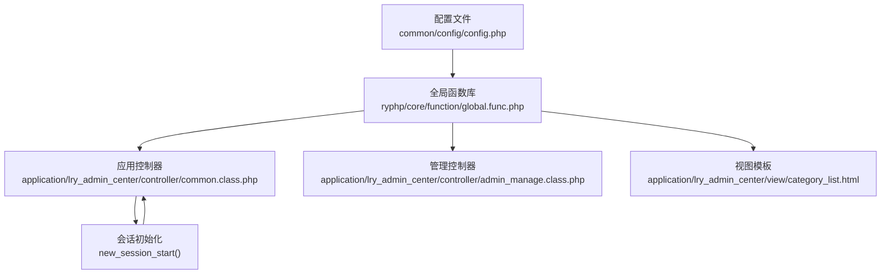
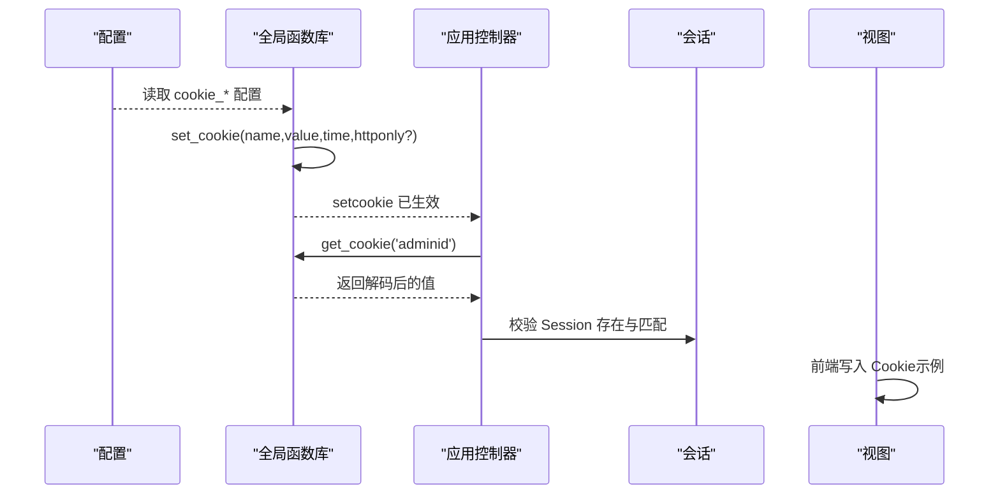
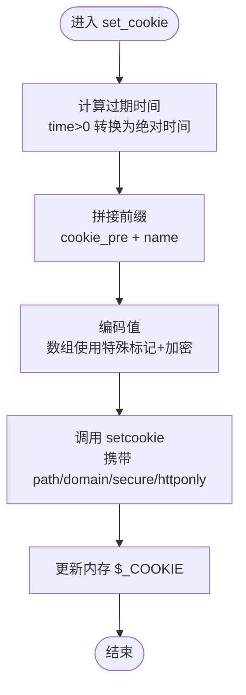
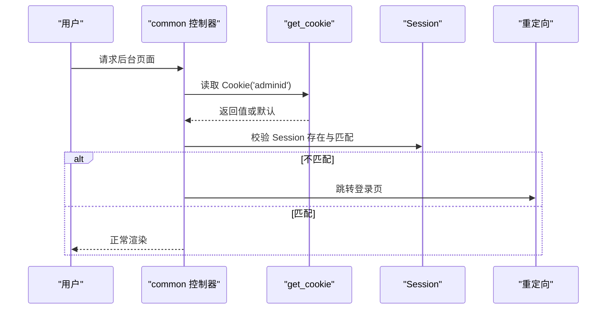
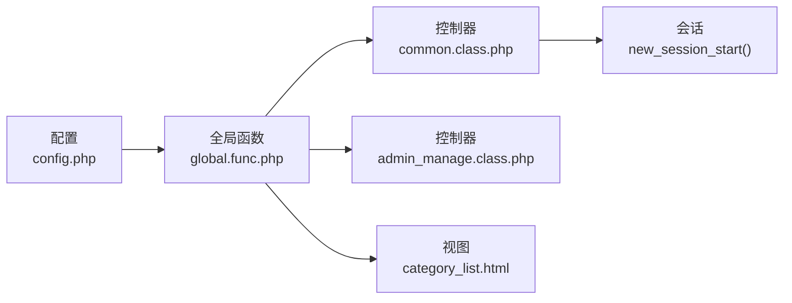

# Cookie配置

<cite>
**本文引用的文件**
- [common/config/config.php](file://common/config/config.php)
- [ryphp/core/function/global.func.php](file://ryphp/core/function/global.func.php)
- [application/lry_admin_center/view/category_list.html](file://application/lry_admin_center/view/category_list.html)
- [application/lry_admin_center/controller/common.class.php](file://application/lry_admin_center/controller/common.class.php)
- [application/lry_admin_center/controller/admin_manage.class.php](file://application/lry_admin_center/controller/admin_manage.class.php)
- [ryphp/core/class/application.class.php](file://ryphp/core/class/application.class.php)
</cite>

## 目录
1. [简介](#简介)
2. [项目结构](#项目结构)
3. [核心组件](#核心组件)
4. [架构总览](#架构总览)
5. [详细组件分析](#详细组件分析)
6. [依赖关系分析](#依赖关系分析)
7. [性能考量](#性能考量)
8. [故障排查指南](#故障排查指南)
9. [结论](#结论)
10. [附录](#附录)

## 简介
本文件聚焦于 LRYBlog（基于 RyPHP 框架）的 Cookie 配置与使用，系统性梳理以下方面：
- Cookie 的四大基础参数：作用域（domain）、作用路径（path）、生命周期（TTL）、前缀（prefix）
- 安全相关参数：仅 HTTPS 传输（secure）、仅 HTTP 访问（httponly）
- 多系统部署场景下的前缀策略与注意事项
- 最佳实践：安全性、跨域与浏览器兼容性
- 测试方法与常见问题排查

## 项目结构
围绕 Cookie 的配置与使用，涉及如下关键位置：
- 全局配置：common/config/config.php 中定义 cookie_* 相关键值
- 服务端 Cookie 读写：ryphp/core/function/global.func.php 提供 set_cookie/get_cookie/del_cookie
- 客户端 Cookie 写入：application/lry_admin_center/view/category_list.html 中的前端脚本
- 登录态与会话安全：application/lry_admin_center/controller/common.class.php 与 new_session_start
- 管理端 Cookie 清理：application/lry_admin_center/controller/admin_manage.class.php 中对管理员 Cookie 的清理逻辑

图表来源
- [common/config/config.php](file://common/config/config.php#L31-L37)
- [ryphp/core/function/global.func.php](file://ryphp/core/function/global.func.php#L1383-L1432)
- [application/lry_admin_center/controller/common.class.php](file://application/lry_admin_center/controller/common.class.php#L4-L4)
- [application/lry_admin_center/controller/admin_manage.class.php](file://application/lry_admin_center/controller/admin_manage.class.php#L93-L94)
- [application/lry_admin_center/view/category_list.html](file://application/lry_admin_center/view/category_list.html#L48-L81)

章节来源
- [common/config/config.php](file://common/config/config.php#L31-L37)
- [ryphp/core/function/global.func.php](file://ryphp/core/function/global.func.php#L1383-L1432)
- [application/lry_admin_center/view/category_list.html](file://application/lry_admin_center/view/category_list.html#L48-L81)
- [application/lry_admin_center/controller/common.class.php](file://application/lry_admin_center/controller/common.class.php#L4-L4)
- [application/lry_admin_center/controller/admin_manage.class.php](file://application/lry_admin_center/controller/admin_manage.class.php#L93-L94)

## 核心组件
- 配置层：集中于 common/config/config.php 的 cookie_* 项，决定 set_cookie/del_cookie 的默认行为
- 业务层：应用控制器在登录态校验中读取 Cookie 并与 Session 对比
- 安全层：new_session_start 将 Session Cookie 设为 httponly；全局函数库统一设置 secure/httponly
- 视图层：模板中存在前端写入 Cookie 的示例，便于前端侧持久化用户界面状态

章节来源
- [common/config/config.php](file://common/config/config.php#L31-L37)
- [ryphp/core/function/global.func.php](file://ryphp/core/function/global.func.php#L1383-L1432)
- [application/lry_admin_center/controller/common.class.php](file://application/lry_admin_center/controller/common.class.php#L36-L48)
- [ryphp/core/function/global.func.php](file://ryphp/core/function/global.func.php#L1698-L1707)

## 架构总览
Cookie 配置在系统中的流转如下：
- 配置读取：C('cookie_*') 从配置文件加载
- 写入流程：set_cookie 统一编码并调用 PHP setcookie，结合 secure/httponly/path/domain/TTL
- 读取流程：get_cookie 解码并返回值或默认值
- 删除流程：del_cookie 清除指定或全部 Cookie
- 登录态：common 控制器读取 Cookie 并与 Session 校验，new_session_start 强化 Session 安全

图表来源
- [common/config/config.php](file://common/config/config.php#L31-L37)
- [ryphp/core/function/global.func.php](file://ryphp/core/function/global.func.php#L1383-L1432)
- [application/lry_admin_center/controller/common.class.php](file://application/lry_admin_center/controller/common.class.php#L36-L48)
- [application/lry_admin_center/view/category_list.html](file://application/lry_admin_center/view/category_list.html#L48-L81)

## 详细组件分析

### 配置参数详解
- 作用域（cookie_domain）
  - 影响范围：同域共享 Cookie 的域名边界
  - 默认值：空字符串（遵循浏览器默认行为）
  - 修改建议：多子域或多系统共存时，建议明确设置为精确域名
- 作用路径（cookie_path）
  - 影响范围：路径前缀匹配
  - 默认值：根路径 /
  - 修改建议：按模块或功能划分路径，缩小影响面
- 生命周期（cookie_ttl）
  - 影响范围：过期时间（秒），0 表示随会话
  - 默认值：0（随会话）
  - 修改建议：登录态建议短 TTL 或滑动刷新；持久化状态可用较长 TTL
- 前缀（cookie_pre）
  - 影响范围：统一前缀，避免多系统冲突
  - 默认值：lryphp_
  - 修改建议：在同一域名下部署多套系统时必须修改，避免互相覆盖
- 安全传输（cookie_secure）
  - 影响范围：仅通过 HTTPS 传输
  - 默认值：false
  - 修改建议：生产环境务必启用 true
- HTTP 仅访问（cookie_httponly）
  - 影响范围：禁止 JS 读取，降低 XSS 风险
  - 默认值：false
  - 修改建议：敏感 Cookie（如登录态）建议启用 true

章节来源
- [common/config/config.php](file://common/config/config.php#L31-L37)

### 服务端 Cookie 读写与安全
- set_cookie
  - 功能：编码值并调用 PHP setcookie，自动拼接 cookie_pre 前缀
  - 安全：优先使用配置中的 cookie_httponly，若未显式传入则采用配置值
  - 生命周期：time>0 时转换为绝对过期时间
- get_cookie
  - 功能：根据前缀读取并解码，支持数组与标量
  - 安全：对输入进行安全替换与解码
- del_cookie
  - 功能：删除单个或全部 Cookie，同时更新 $_COOKIE
  - 安全：使用配置中的 secure/httponly/path/domain

图表来源
- [ryphp/core/function/global.func.php](file://ryphp/core/function/global.func.php#L1383-L1390)

章节来源
- [ryphp/core/function/global.func.php](file://ryphp/core/function/global.func.php#L1383-L1432)

### 登录态与会话安全
- 登录态校验
  - common 控制器在构造阶段读取 Cookie 并与 Session 校验，不一致则重定向登录页
- 会话安全
  - new_session_start 将 Session Cookie 设为 httponly，并对异常 Cookie 名称进行清理
  - create_token/check_token 提供 CSRF Token 保护

图表来源
- [application/lry_admin_center/controller/common.class.php](file://application/lry_admin_center/controller/common.class.php#L36-L48)
- [ryphp/core/function/global.func.php](file://ryphp/core/function/global.func.php#L1399-L1411)
- [ryphp/core/function/global.func.php](file://ryphp/core/function/global.func.php#L1698-L1707)

章节来源
- [application/lry_admin_center/controller/common.class.php](file://application/lry_admin_center/controller/common.class.php#L4-L4)
- [application/lry_admin_center/controller/common.class.php](file://application/lry_admin_center/controller/common.class.php#L36-L48)
- [ryphp/core/function/global.func.php](file://ryphp/core/function/global.func.php#L1698-L1707)

### 前端 Cookie 写入示例
- category_list.html 中提供前端写 Cookie 的示例，包含：
  - 参数校验、编码、可选过期时间
  - path=/ 与 SameSite=Lax 的设置
- 注意：该示例用于前端持久化界面状态，与后端 set_cookie 的安全策略不同，不应混用

章节来源
- [application/lry_admin_center/view/category_list.html](file://application/lry_admin_center/view/category_list.html#L48-L81)

### 管理端 Cookie 清理
- admin_manage.class.php 在修改密码后调用 del_cookie 清理管理员相关 Cookie，确保强制重新登录

章节来源
- [application/lry_admin_center/controller/admin_manage.class.php](file://application/lry_admin_center/controller/admin_manage.class.php#L93-L94)

## 依赖关系分析
- 配置依赖：global.func.php 依赖 C('cookie_*') 读取配置
- 控制器依赖：common 控制器依赖 get_cookie 与 Session 校验
- 视图依赖：category_list.html 依赖前端 Cookie 写入能力
- 安全依赖：new_session_start 依赖 ini_set 与会话机制

图表来源
- [common/config/config.php](file://common/config/config.php#L31-L37)
- [ryphp/core/function/global.func.php](file://ryphp/core/function/global.func.php#L1383-L1432)
- [application/lry_admin_center/controller/common.class.php](file://application/lry_admin_center/controller/common.class.php#L4-L4)
- [application/lry_admin_center/controller/admin_manage.class.php](file://application/lry_admin_center/controller/admin_manage.class.php#L93-L94)
- [application/lry_admin_center/view/category_list.html](file://application/lry_admin_center/view/category_list.html#L48-L81)

章节来源
- [common/config/config.php](file://common/config/config.php#L31-L37)
- [ryphp/core/function/global.func.php](file://ryphp/core/function/global.func.php#L1383-L1432)
- [application/lry_admin_center/controller/common.class.php](file://application/lry_admin_center/controller/common.class.php#L4-L4)
- [application/lry_admin_center/controller/admin_manage.class.php](file://application/lry_admin_center/controller/admin_manage.class.php#L93-L94)
- [application/lry_admin_center/view/category_list.html](file://application/lry_admin_center/view/category_list.html#L48-L81)

## 性能考量
- Cookie 体积与数量：尽量精简键值，避免大对象存储
- 生命周期：合理设置 TTL，减少无效请求携带
- 加密成本：set_cookie 对值进行编码/解码，频繁读写时注意 CPU 开销
- 前缀策略：多系统前缀隔离可避免冲突，但不会显著增加性能负担

## 故障排查指南
- 症状：登录后仍被重定向到登录页
  - 排查点：检查 Cookie 域名与路径是否正确；确认 get_cookie 读取的键名包含 cookie_pre 前缀；核对 Session 是否存在且匹配
- 症状：Cookie 无法被读取（JS）
  - 排查点：确认 cookie_httponly=true 时前端无法通过 document.cookie 读取；如需前端读取请关闭 httponly
- 症状：HTTPS 环境下 Cookie 丢失
  - 排查点：确认 cookie_secure=true 且浏览器仅在 HTTPS 下发送 Cookie
- 症状：多系统共存时 Cookie 互相覆盖
  - 排查点：修改 cookie_pre，确保每套系统唯一
- 症状：跨域或第三方 Cookie 限制导致失效
  - 排查点：SameSite/Lax/RFC 新规对跨站场景的影响；必要时调整 SameSite 或使用代理/反向代理策略
- 症状：前端写入 Cookie 失败
  - 排查点：检查浏览器隐私设置、第三方 Cookie 策略、path/domain 是否匹配

章节来源
- [ryphp/core/function/global.func.php](file://ryphp/core/function/global.func.php#L1399-L1411)
- [application/lry_admin_center/controller/common.class.php](file://application/lry_admin_center/controller/common.class.php#L36-L48)
- [application/lry_admin_center/view/category_list.html](file://application/lry_admin_center/view/category_list.html#L48-L81)

## 结论
- Cookie 配置应以安全为先：生产环境启用 cookie_secure 与 cookie_httponly
- 多系统部署必须修改 cookie_pre，避免键名冲突
- 合理设置 domain/path/TTL，兼顾功能性与安全性
- 前后端 Cookie 策略不同，应按场景选择合适方案
- 建立完善的测试与排错流程，确保登录态与会话安全稳定

## 附录

### Cookie 配置清单与建议
- cookie_domain：生产环境建议明确为精确域名
- cookie_path：按模块划分路径，缩小影响范围
- cookie_ttl：登录态建议短 TTL 或滑动刷新；持久化状态可适当延长
- cookie_pre：多系统必改，确保唯一性
- cookie_secure：生产 HTTPS 必启用
- cookie_httponly：敏感 Cookie 建议启用

章节来源
- [common/config/config.php](file://common/config/config.php#L31-L37)