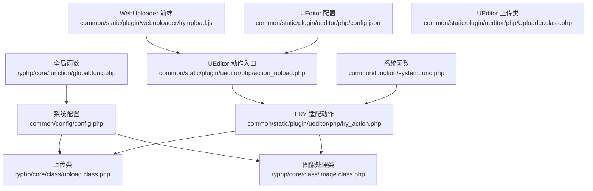
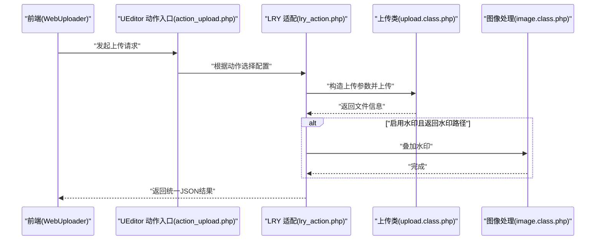
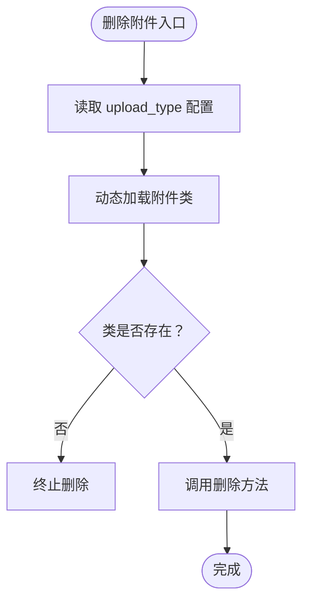
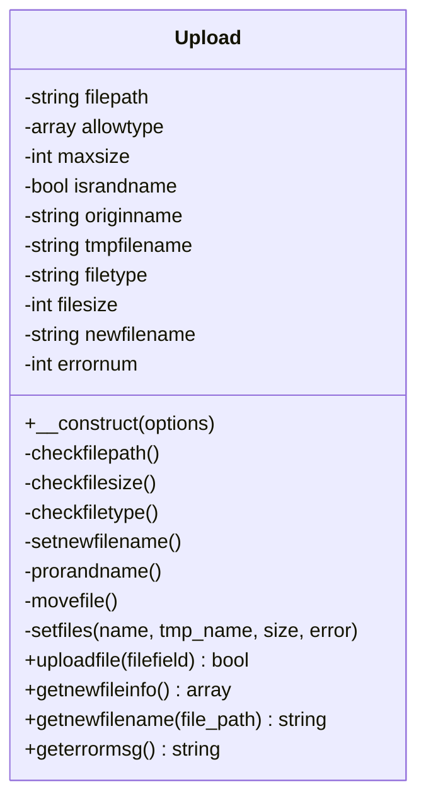
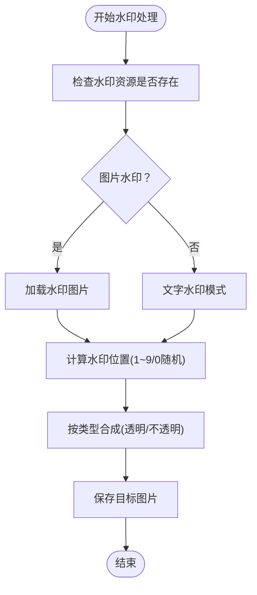
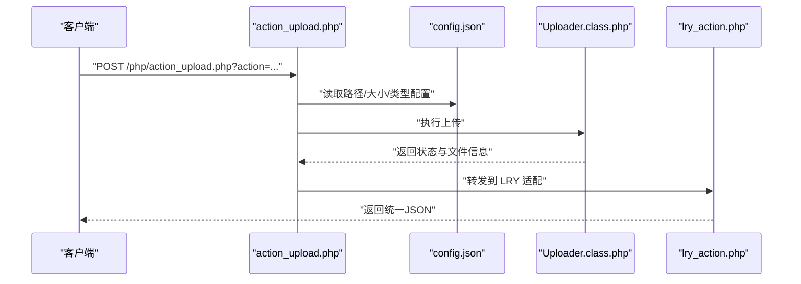
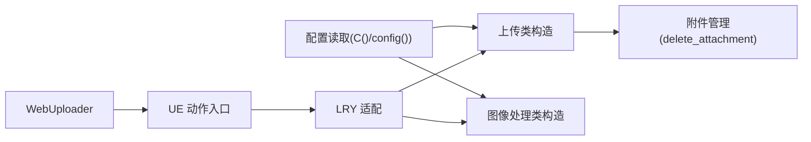

# 上传配置

<cite>
**本文引用的文件**
- [common/config/config.php](file://common/config/config.php)
- [ryphp/core/class/upload.class.php](file://ryphp/core/class/upload.class.php)
- [ryphp/core/class/image.class.php](file://ryphp/core/class/image.class.php)
- [common/static/plugin/webuploader/lry.upload.js](file://common/static/plugin/webuploader/lry.upload.js)
- [common/static/plugin/ueditor/php/config.json](file://common/static/plugin/ueditor/php/config.json)
- [common/static/plugin/ueditor/php/Uploader.class.php](file://common/static/plugin/ueditor/php/Uploader.class.php)
- [common/static/plugin/ueditor/php/action_upload.php](file://common/static/plugin/ueditor/php/action_upload.php)
- [common/static/plugin/ueditor/php/lry_action.php](file://common/static/plugin/ueditor/php/lry_action.php)
- [common/function/system.func.php](file://common/function/system.func.php)
- [ryphp/core/function/global.func.php](file://ryphp/core/function/global.func.php)
</cite>

## 目录
1. [引言](#引言)
2. [项目结构](#项目结构)
3. [核心组件](#核心组件)
4. [架构总览](#架构总览)
5. [详细组件分析](#详细组件分析)
6. [依赖关系分析](#依赖关系分析)
7. [性能考量](#性能考量)
8. [故障排除指南](#故障排除指南)
9. [结论](#结论)

## 引言
本文件聚焦于 LRYBlog 的文件上传配置，系统性梳理上传类型（upload_type）、本地上传目录（upload_file）、图片水印（watermark_enable、watermark_name、watermark_position）等关键配置项；同时覆盖上传类型与文件管理系统的关系、安全与合规建议、文件类型与大小限制策略，以及常见问题排查方法。文档面向技术与非技术读者，力求以循序渐进的方式呈现。

## 项目结构
围绕上传配置的关键文件分布如下：
- 系统配置：common/config/config.php
- 上传核心类：ryphp/core/class/upload.class.php
- 图像处理与水印：ryphp/core/class/image.class.php
- WebUploader 前端上传插件：common/static/plugin/webuploader/lry.upload.js
- UEditor 后端上传适配：common/static/plugin/ueditor/php/*.php
- 系统函数与配置读取：common/function/system.func.php、ryphp/core/function/global.func.php

图表来源
- [common/config/config.php](file://common/config/config.php#L75-L81)
- [ryphp/core/class/upload.class.php](file://ryphp/core/class/upload.class.php#L10-L52)
- [ryphp/core/class/image.class.php](file://ryphp/core/class/image.class.php#L27-L34)
- [common/static/plugin/webuploader/lry.upload.js](file://common/static/plugin/webuploader/lry.upload.js#L157-L159)
- [common/static/plugin/ueditor/php/config.json](file://common/static/plugin/ueditor/php/config.json#L1-L38)
- [common/static/plugin/ueditor/php/Uploader.class.php](file://common/static/plugin/ueditor/php/Uploader.class.php#L54-L66)
- [common/static/plugin/ueditor/php/action_upload.php](file://common/static/plugin/ueditor/php/action_upload.php#L13-L49)
- [common/static/plugin/ueditor/php/lry_action.php](file://common/static/plugin/ueditor/php/lry_action.php#L231-L257)
- [common/function/system.func.php](file://common/function/system.func.php#L539-L550)
- [ryphp/core/function/global.func.php](file://ryphp/core/function/global.func.php#L4-L26)

章节来源
- [common/config/config.php](file://common/config/config.php#L75-L81)
- [ryphp/core/class/upload.class.php](file://ryphp/core/class/upload.class.php#L10-L52)
- [ryphp/core/class/image.class.php](file://ryphp/core/class/image.class.php#L27-L34)
- [common/static/plugin/webuploader/lry.upload.js](file://common/static/plugin/webuploader/lry.upload.js#L157-L159)
- [common/static/plugin/ueditor/php/config.json](file://common/static/plugin/ueditor/php/config.json#L1-L38)
- [common/static/plugin/ueditor/php/Uploader.class.php](file://common/static/plugin/ueditor/php/Uploader.class.php#L54-L66)
- [common/static/plugin/ueditor/php/action_upload.php](file://common/static/plugin/ueditor/php/action_upload.php#L13-L49)
- [common/static/plugin/ueditor/php/lry_action.php](file://common/static/plugin/ueditor/php/lry_action.php#L231-L257)
- [common/function/system.func.php](file://common/function/system.func.php#L539-L550)
- [ryphp/core/function/global.func.php](file://ryphp/core/function/global.func.php#L4-L26)

## 核心组件
- 上传类型（upload_type）
  - 支持 host（本地）、qiniu（七牛云）、aliyun（阿里云）、tencent（腾讯云）
  - 该配置决定上传行为与后续附件管理器的实例化
- 本地上传目录（upload_file）
  - 默认 uploads，不带尾部斜杠
  - 上传类会在该目录下按“年/月/日”分层组织文件
- 图片水印（watermark_enable、watermark_name、watermark_position）
  - watermark_enable：是否启用
  - watermark_name：水印文件名（位于 common/data/water/）
  - watermark_position：水印位置（0~9，0为随机）

章节来源
- [common/config/config.php](file://common/config/config.php#L75-L81)
- [ryphp/core/class/upload.class.php](file://ryphp/core/class/upload.class.php#L47-L51)
- [ryphp/core/class/image.class.php](file://ryphp/core/class/image.class.php#L27-L34)

## 架构总览
上传流程概览（以 WebUploader 为例）：
- 前端选择文件后，触发上传事件
- 上传前携带 open_watermark 参数（来自前端复选框）
- 后端 action_upload.php 根据请求动作选择配置
- lry_action.php 组装上传参数并调用上传类
- 上传成功后，若启用水印，调用图像处理类进行水印叠加
- 最终返回统一的 JSON 结果

图表来源
- [common/static/plugin/webuploader/lry.upload.js](file://common/static/plugin/webuploader/lry.upload.js#L157-L159)
- [common/static/plugin/ueditor/php/action_upload.php](file://common/static/plugin/ueditor/php/action_upload.php#L13-L49)
- [common/static/plugin/ueditor/php/lry_action.php](file://common/static/plugin/ueditor/php/lry_action.php#L231-L257)
- [ryphp/core/class/upload.class.php](file://ryphp/core/class/upload.class.php#L189-L203)
- [ryphp/core/class/image.class.php](file://ryphp/core/class/image.class.php#L245-L247)

## 详细组件分析

### 上传类型与附件管理集成
- 附件删除时，系统根据 upload_type 实例化对应附件类并调用删除方法
- 若类不存在，删除流程终止

图表来源
- [common/function/system.func.php](file://common/function/system.func.php#L539-L550)

章节来源
- [common/function/system.func.php](file://common/function/system.func.php#L539-L550)

### 本地上传类（upload.class.php）
- 初始化
  - 默认允许类型：png、jpg、jpeg、gif
  - 默认最大文件大小：2MB
  - 上传目录：基于配置的 upload_file + 年/月/日
  - 最大上传大小：由配置项 upload_maxsize（KB）转换为字节
- 校验与移动
  - 检查上传路径是否存在且可写，必要时自动创建
  - 校验文件类型与大小
  - 生成新文件名（默认随机命名）
  - 移动临时文件至目标路径
- 错误处理
  - 映射 PHP 上传错误码与自定义错误码
  - 提供 geterrormsg() 获取可读错误信息

图表来源
- [ryphp/core/class/upload.class.php](file://ryphp/core/class/upload.class.php#L10-L241)

章节来源
- [ryphp/core/class/upload.class.php](file://ryphp/core/class/upload.class.php#L10-L52)
- [ryphp/core/class/upload.class.php](file://ryphp/core/class/upload.class.php#L77-L120)
- [ryphp/core/class/upload.class.php](file://ryphp/core/class/upload.class.php#L155-L166)
- [ryphp/core/class/upload.class.php](file://ryphp/core/class/upload.class.php#L189-L203)
- [ryphp/core/class/upload.class.php](file://ryphp/core/class/upload.class.php#L237-L239)

### 图像处理与水印（image.class.php）
- 构造函数
  - 读取配置：watermark_enable、watermark_position、watermark_name
  - 水印文件路径：common/data/water/{watermark_name}
  - 水印最小宽高阈值（来自配置）
- 水印叠加
  - 支持图片水印与文字水印两种模式
  - 水印位置：0（随机）、1~9（九宫格定位）
  - 透明度、质量、最小尺寸等参数可调
- 返回值：成功返回 true，失败返回 false

图表来源
- [ryphp/core/class/image.class.php](file://ryphp/core/class/image.class.php#L27-L34)
- [ryphp/core/class/image.class.php](file://ryphp/core/class/image.class.php#L245-L356)

章节来源
- [ryphp/core/class/image.class.php](file://ryphp/core/class/image.class.php#L27-L34)
- [ryphp/core/class/image.class.php](file://ryphp/core/class/image.class.php#L245-L356)

### UEditor 后端适配（action_upload.php、Uploader.class.php、lry_action.php）
- 动作入口
  - 根据 action（uploadimage、uploadscrawl、uploadvideo、uploadfile）选择对应配置
  - 读取 UEditor 配置文件（config.json）中的路径格式、大小限制、允许类型
- 上传实现
  - Uploader.class.php 校验大小、类型、目录可写性并移动文件
- LRY 适配
  - lry_action.php 组装上传参数，调用上传类
  - 若启用水印，调用图像处理类叠加水印
  - 写入附件记录并返回统一 JSON

图表来源
- [common/static/plugin/ueditor/php/action_upload.php](file://common/static/plugin/ueditor/php/action_upload.php#L13-L49)
- [common/static/plugin/ueditor/php/config.json](file://common/static/plugin/ueditor/php/config.json#L1-L38)
- [common/static/plugin/ueditor/php/Uploader.class.php](file://common/static/plugin/ueditor/php/Uploader.class.php#L74-L127)
- [common/static/plugin/ueditor/php/lry_action.php](file://common/static/plugin/ueditor/php/lry_action.php#L231-L257)

章节来源
- [common/static/plugin/ueditor/php/action_upload.php](file://common/static/plugin/ueditor/php/action_upload.php#L13-L49)
- [common/static/plugin/ueditor/php/config.json](file://common/static/plugin/ueditor/php/config.json#L1-L38)
- [common/static/plugin/ueditor/php/Uploader.class.php](file://common/static/plugin/ueditor/php/Uploader.class.php#L74-L127)
- [common/static/plugin/ueditor/php/lry_action.php](file://common/static/plugin/ueditor/php/lry_action.php#L231-L257)

### WebUploader 前端上传（lry.upload.js）
- 上传前发送 open_watermark 参数（来自复选框状态）
- 错误提示：类型不符、大小超限、数量限制、重复文件等
- 成功回调：根据文件类型展示缩略图或默认图标

章节来源
- [common/static/plugin/webuploader/lry.upload.js](file://common/static/plugin/webuploader/lry.upload.js#L157-L159)
- [common/static/plugin/webuploader/lry.upload.js](file://common/static/plugin/webuploader/lry.upload.js#L143-L155)
- [common/static/plugin/webuploader/lry.upload.js](file://common/static/plugin/webuploader/lry.upload.js#L114-L127)

## 依赖关系分析
- 配置读取
  - C()/config() 提供配置读取能力，upload 类在构造时读取 upload_maxsize 并转换为字节
- 上传类型与附件管理
  - delete_attachment 根据 upload_type 动态实例化附件类，实现与具体云存储的解耦
- UEditor 与 LRY 适配
  - UEditor 侧通过 config.json 控制路径与大小，LRY 侧统一调用上传类与水印处理

图表来源
- [ryphp/core/function/global.func.php](file://ryphp/core/function/global.func.php#L4-L26)
- [ryphp/core/class/upload.class.php](file://ryphp/core/class/upload.class.php#L50-L51)
- [common/function/system.func.php](file://common/function/system.func.php#L539-L550)
- [common/static/plugin/webuploader/lry.upload.js](file://common/static/plugin/webuploader/lry.upload.js#L157-L159)
- [common/static/plugin/ueditor/php/action_upload.php](file://common/static/plugin/ueditor/php/action_upload.php#L13-L49)
- [common/static/plugin/ueditor/php/lry_action.php](file://common/static/plugin/ueditor/php/lry_action.php#L231-L257)

章节来源
- [ryphp/core/function/global.func.php](file://ryphp/core/function/global.func.php#L4-L26)
- [ryphp/core/class/upload.class.php](file://ryphp/core/class/upload.class.php#L50-L51)
- [common/function/system.func.php](file://common/function/system.func.php#L539-L550)
- [common/static/plugin/webuploader/lry.upload.js](file://common/static/plugin/webuploader/lry.upload.js#L157-L159)
- [common/static/plugin/ueditor/php/action_upload.php](file://common/static/plugin/ueditor/php/action_upload.php#L13-L49)
- [common/static/plugin/ueditor/php/lry_action.php](file://common/static/plugin/ueditor/php/lry_action.php#L231-L257)

## 性能考量
- 本地上传目录分层
  - 按“年/月/日”分层可降低单目录文件数量，提升文件系统性能
- 水印处理
  - 水印叠加在上传完成后进行，建议控制水印图片尺寸与透明度，避免过度消耗 CPU
- UEditor 上传
  - 前端限制与后端限制双重保障，减少无效请求与磁盘 IO

[本节为通用指导，无需列出章节来源]

## 故障排除指南
- 上传路径权限问题
  - 现象：创建上传目录失败，错误提示“必须指定上传文件的路径”或“创建上传文件目录失败，请检查权限”
  - 处理：确保 upload_file 目录存在且具备写权限；确认路径末尾不带斜杠
- 文件类型被拒绝
  - 现象：错误提示“未充许的类型”
  - 处理：核对 allowtype 与配置文件中的允许类型；UEditor 侧需同步调整 config.json 中的 allowFiles
- 文件大小超限
  - 现象：错误提示“文件过大，不能超过...”
  - 处理：调整 upload_maxsize（KB）与前端限制（如 WebUploader 的 fileSingleSizeLimit）
- 水印文件缺失
  - 现象：水印叠加失败
  - 处理：确认 watermark_name 指定的文件存在于 common/data/water/，并检查权限
- UEditor 上传错误
  - 现象：ERROR_CREATE_DIR、ERROR_DIR_NOT_WRITEABLE、ERROR_FILE_MOVE 等
  - 处理：检查目录可写性、磁盘空间、临时文件夹可用性

章节来源
- [ryphp/core/class/upload.class.php](file://ryphp/core/class/upload.class.php#L81-L94)
- [ryphp/core/class/upload.class.php](file://ryphp/core/class/upload.class.php#L113-L120)
- [ryphp/core/class/upload.class.php](file://ryphp/core/class/upload.class.php#L100-L107)
- [ryphp/core/class/upload.class.php](file://ryphp/core/class/upload.class.php#L57-L75)
- [ryphp/core/class/image.class.php](file://ryphp/core/class/image.class.php#L245-L247)
- [common/static/plugin/ueditor/php/Uploader.class.php](file://common/static/plugin/ueditor/php/Uploader.class.php#L113-L119)
- [common/static/plugin/ueditor/php/Uploader.class.php](file://common/static/plugin/ueditor/php/Uploader.class.php#L122-L126)

## 结论
- 上传类型（upload_type）决定了附件管理器的实现形态，结合配置即可无缝切换本地或云存储
- 本地上传目录（upload_file）与分层策略直接影响性能与可维护性
- 图片水印通过配置即可启用，水印文件与位置可灵活定制
- 前端 WebUploader 与后端 UEditor 适配形成闭环，配合统一的错误处理与安全策略，可稳定支撑各类上传场景