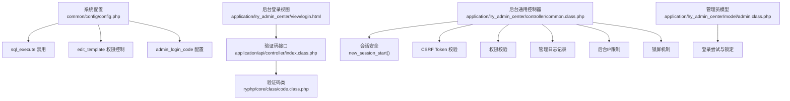
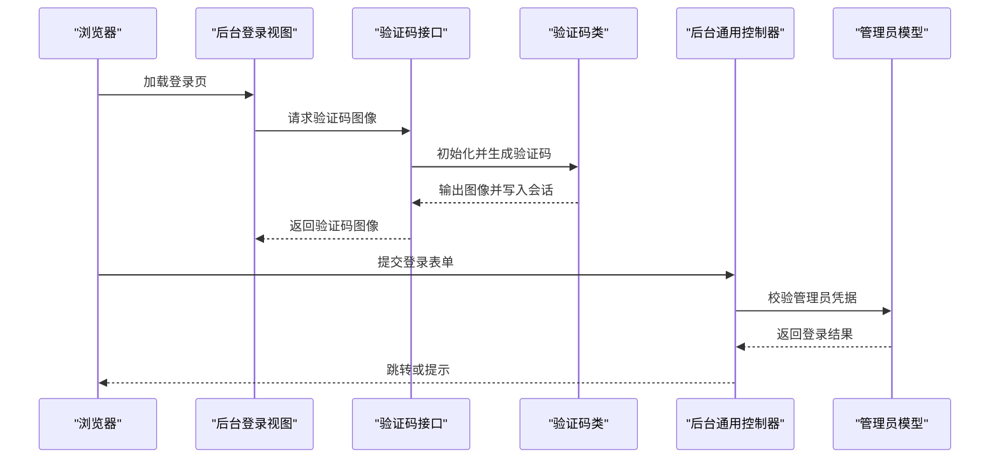
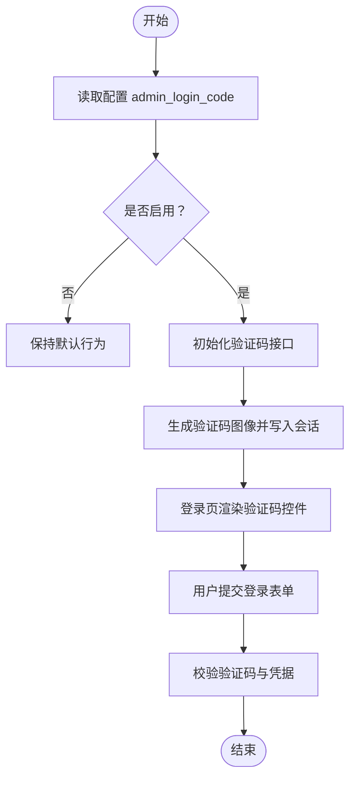
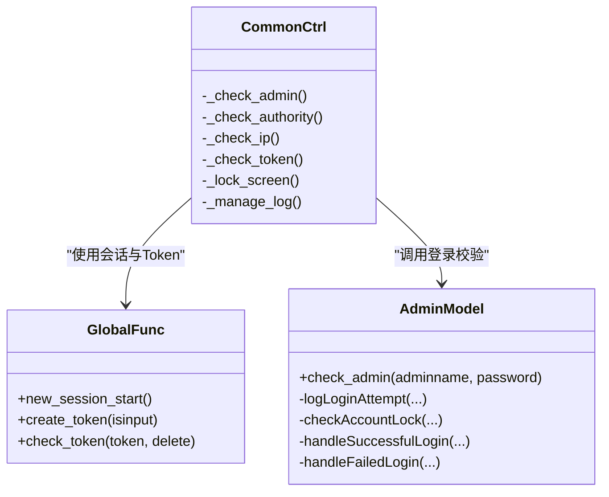
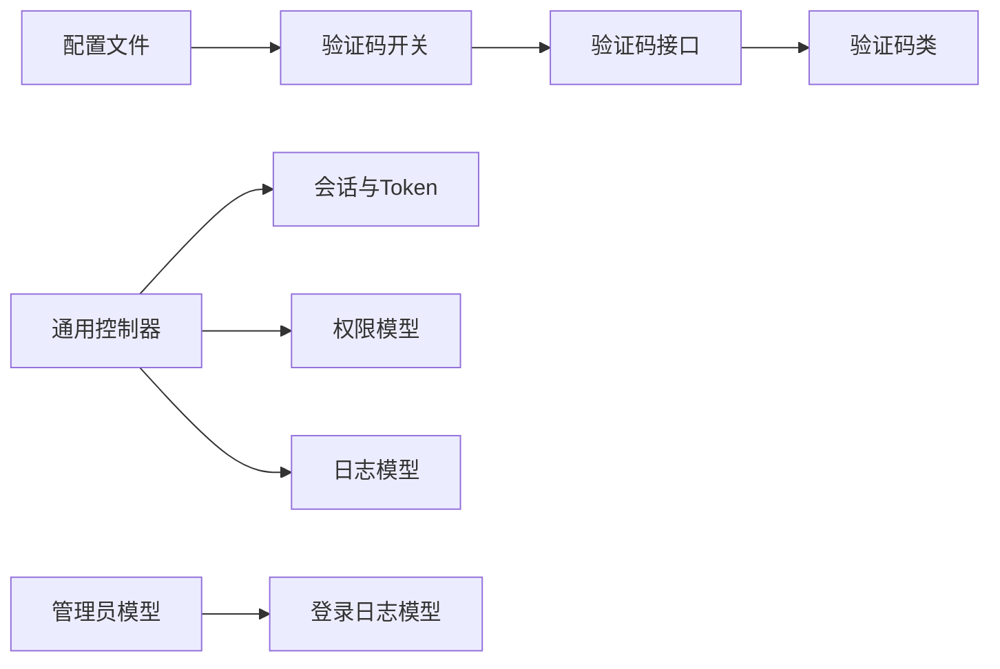

# 安全配置

<cite>
**本文引用的文件**
- [common/config/config.php](file://common/config/config.php)
- [application/lry_admin_center/view/login.html](file://application/lry_admin_center/view/login.html)
- [application/api/controller/index.class.php](file://application/api/controller/index.class.php)
- [ryphp/core/class/code.class.php](file://ryphp/core/class/code.class.php)
- [application/lry_admin_center/controller/common.class.php](file://application/lry_admin_center/controller/common.class.php)
- [application/lry_admin_center/model/admin.class.php](file://application/lry_admin_center/model/admin.class.php)
- [ryphp/core/function/global.func.php](file://ryphp/core/function/global.func.php)
- [common/function/system.func.php](file://common/function/system.func.php)
</cite>

## 目录
1. [引言](#引言)
2. [项目结构](#项目结构)
3. [核心组件](#核心组件)
4. [架构总览](#架构总览)
5. [详细组件分析](#详细组件分析)
6. [依赖分析](#依赖分析)
7. [性能考虑](#性能考虑)
8. [故障排查指南](#故障排查指南)
9. [结论](#结论)
10. [附录](#附录)

## 引言
本文件聚焦于 LRYBlog 的安全配置，围绕以下关键点展开：在线执行 SQL 命令的禁用策略、模板在线编辑的权限控制、管理员登录验证码的配置与启用、系统密钥的作用与修改方法，并结合现有实现给出最佳实践、常见威胁防护与应急处理流程。

## 项目结构
LRYBlog 的安全相关配置主要集中在系统配置文件中，前端登录界面与验证码接口位于后台视图与 API 控制器，后台通用控制器负责会话、CSRF Token、权限与审计等安全机制，验证码生成由专用类完成。

**图表来源**
- [common/config/config.php](file://common/config/config.php#L83-L85)
- [application/lry_admin_center/view/login.html](file://application/lry_admin_center/view/login.html#L24-L28)
- [application/api/controller/index.class.php](file://application/api/controller/index.class.php#L6-L17)
- [ryphp/core/class/code.class.php](file://ryphp/core/class/code.class.php#L1-L175)
- [application/lry_admin_center/controller/common.class.php](file://application/lry_admin_center/controller/common.class.php#L1-L153)
- [application/lry_admin_center/model/admin.class.php](file://application/lry_admin_center/model/admin.class.php#L1-L96)

**章节来源**
- [common/config/config.php](file://common/config/config.php#L1-L88)
- [application/lry_admin_center/view/login.html](file://application/lry_admin_center/view/login.html#L1-L98)
- [application/api/controller/index.class.php](file://application/api/controller/index.class.php#L1-L22)
- [ryphp/core/class/code.class.php](file://ryphp/core/class/code.class.php#L1-L175)
- [application/lry_admin_center/controller/common.class.php](file://application/lry_admin_center/controller/common.class.php#L1-L153)
- [application/lry_admin_center/model/admin.class.php](file://application/lry_admin_center/model/admin.class.php#L1-L96)

## 核心组件
- 系统配置项
  - sql_execute：默认关闭，禁止在线执行 SQL 命令，降低注入与误操作风险。
  - edit_template：默认关闭，禁止在线编辑模板，避免直接写入模板导致的远程代码执行。
  - admin_login_code：默认关闭，验证码开关值，配合登录接口与视图启用图形验证码。
  - auth_key：系统密钥，用于加密、签名与会话安全相关用途。
- 登录验证码
  - 后台登录页提供验证码输入与刷新；验证码生成由 API 控制器调用验证码类输出图像并写入会话。
- 会话与 CSRF
  - 统一会话启动函数强制 HttpOnly Cookie；提供 Token 生成与校验，防跨站请求伪造。
- 权限与审计
  - 后台统一控制器进行管理员身份校验、权限判定、IP 白/黑名单、锁屏、管理日志记录。
- 登录安全
  - 管理员模型对失败登录次数进行阶梯式锁定，记录登录日志，提升抗暴力破解能力。

**章节来源**
- [common/config/config.php](file://common/config/config.php#L83-L85)
- [application/lry_admin_center/view/login.html](file://application/lry_admin_center/view/login.html#L24-L28)
- [application/api/controller/index.class.php](file://application/api/controller/index.class.php#L6-L17)
- [ryphp/core/class/code.class.php](file://ryphp/core/class/code.class.php#L1-L175)
- [application/lry_admin_center/controller/common.class.php](file://application/lry_admin_center/controller/common.class.php#L1-L153)
- [application/lry_admin_center/model/admin.class.php](file://application/lry_admin_center/model/admin.class.php#L1-L96)
- [ryphp/core/function/global.func.php](file://ryphp/core/function/global.func.php#L1693-L1731)

## 架构总览
下图展示登录与验证码、会话与权限控制的整体交互。

**图表来源**
- [application/lry_admin_center/view/login.html](file://application/lry_admin_center/view/login.html#L14-L94)
- [application/api/controller/index.class.php](file://application/api/controller/index.class.php#L6-L17)
- [ryphp/core/class/code.class.php](file://ryphp/core/class/code.class.php#L56-L165)
- [application/lry_admin_center/controller/common.class.php](file://application/lry_admin_center/controller/common.class.php#L32-L50)
- [application/lry_admin_center/model/admin.class.php](file://application/lry_admin_center/model/admin.class.php#L4-L27)

## 详细组件分析

### 在线执行 SQL 命令（sql_execute）禁用
- 配置位置与含义
  - 配置项：common/config/config.php 中的 sql_execute，默认为关闭。
  - 作用：禁止在后台或前台通过界面直接执行 SQL 命令，避免高危操作与注入风险。
- 实施要点
  - 生产环境务必保持关闭；如需数据库维护，应通过安全渠道与白名单机制执行。
  - 结合最小权限原则，数据库账号仅授予必要权限，避免授予高危权限。
- 风险与影响
  - 若开启，可能被利用执行任意 SQL，造成数据泄露、篡改或删除。

**章节来源**
- [common/config/config.php](file://common/config/config.php#L83-L83)

### 模板在线编辑（edit_template）权限控制
- 配置位置与含义
  - 配置项：common/config/config.php 中的 edit_template，默认为关闭。
  - 作用：禁止在线编辑模板，避免直接写入模板导致的远程代码执行与业务破坏。
- 实施要点
  - 生产环境保持关闭；模板变更应通过版本化部署与代码审查。
  - 如确需在线编辑，应配合严格的权限校验与审计日志。
- 风险与影响
  - 开启后若未做严格鉴权与输入校验，易被注入恶意脚本。

**章节来源**
- [common/config/config.php](file://common/config/config.php#L84-L84)

### 管理员登录验证码（admin_login_code）配置与启用
- 配置项与默认值
  - 配置项：common/config/config.php 中的 admin_login_code，默认为关闭。
  - 含义：验证码开关值，配合登录视图与验证码接口启用图形验证码。
- 登录视图与验证码接口
  - 登录页提供验证码输入框与刷新按钮，提交时携带验证码。
  - 验证码接口根据参数动态调整尺寸与长度，生成图像并写入会话。
- 验证码类
  - 验证码类负责生成图像、绘制干扰元素与输出 PNG，确保 GD 库可用。
- 启用步骤
  - 将 admin_login_code 设为启用值（具体数值取决于业务层对“启用”的定义）。
  - 确保验证码接口与登录视图正常加载，会话已正确初始化。
- 风险与影响
  - 启用验证码可显著降低暴力破解成功率；未启用时需依赖其他风控手段。

**图表来源**
- [common/config/config.php](file://common/config/config.php#L85-L85)
- [application/lry_admin_center/view/login.html](file://application/lry_admin_center/view/login.html#L24-L28)
- [application/api/controller/index.class.php](file://application/api/controller/index.class.php#L6-L17)
- [ryphp/core/class/code.class.php](file://ryphp/core/class/code.class.php#L56-L165)

**章节来源**
- [common/config/config.php](file://common/config/config.php#L85-L85)
- [application/lry_admin_center/view/login.html](file://application/lry_admin_center/view/login.html#L24-L28)
- [application/api/controller/index.class.php](file://application/api/controller/index.class.php#L6-L17)
- [ryphp/core/class/code.class.php](file://ryphp/core/class/code.class.php#L1-L175)

### 系统密钥（auth_key）的安全作用与修改方法
- 安全作用
  - 系统密钥用于加密、签名与会话安全相关用途，是保障系统完整性与机密性的基础。
- 修改方法
  - 在 common/config/config.php 中更新 auth_key 的值。
  - 修改后需重启应用或按框架要求使新密钥生效。
- 最佳实践
  - 密钥长度足够且复杂，定期轮换。
  - 严格控制密钥存储与分发，避免硬编码在可公开源码中。

**章节来源**
- [common/config/config.php](file://common/config/config.php#L6-L6)

### 会话安全与 CSRF 防护
- 会话安全
  - 统一会话启动函数强制 Cookie HttpOnly，降低 XSS 获取会话的风险。
- CSRF Token
  - 提供 Token 生成与校验函数，后台通用控制器在非公开动作中校验 Token，防止跨站请求伪造。
- 登录安全
  - 管理员模型对失败登录进行阶梯式锁定与日志记录，降低暴力破解成功率。

**图表来源**
- [ryphp/core/function/global.func.php](file://ryphp/core/function/global.func.php#L1693-L1731)
- [application/lry_admin_center/controller/common.class.php](file://application/lry_admin_center/controller/common.class.php#L32-L131)
- [application/lry_admin_center/model/admin.class.php](file://application/lry_admin_center/model/admin.class.php#L4-L95)

**章节来源**
- [ryphp/core/function/global.func.php](file://ryphp/core/function/global.func.php#L1693-L1731)
- [application/lry_admin_center/controller/common.class.php](file://application/lry_admin_center/controller/common.class.php#L1-L153)
- [application/lry_admin_center/model/admin.class.php](file://application/lry_admin_center/model/admin.class.php#L1-L96)

### 权限控制与审计
- 权限控制
  - 后台统一控制器对模块、控制器、动作进行权限判定；超级管理员与公开动作例外。
- 审计日志
  - 可选的管理日志记录，记录管理员的关键操作，便于事后审计与追踪。
- IP 限制
  - 支持后台禁止登录 IP 列表，命中即拒绝访问。

**章节来源**
- [application/lry_admin_center/controller/common.class.php](file://application/lry_admin_center/controller/common.class.php#L56-L82)
- [application/lry_admin_center/controller/common.class.php](file://application/lry_admin_center/controller/common.class.php#L86-L93)

### 登录安全与暴力破解防护
- 失败次数阶梯式锁定
  - 失败达到阈值后按阶梯规则延长锁定时间，降低暴力破解成功率。
- 登录日志
  - 记录登录尝试、原因与结果，辅助安全分析。

**章节来源**
- [application/lry_admin_center/model/admin.class.php](file://application/lry_admin_center/model/admin.class.php#L40-L65)
- [application/lry_admin_center/model/admin.class.php](file://application/lry_admin_center/model/admin.class.php#L29-L38)

## 依赖分析
- 配置依赖
  - 后台登录验证码启用与否取决于配置项；验证码接口依赖验证码类生成图像。
- 控制器依赖
  - 后台通用控制器依赖会话与 Token 函数、权限模型与日志模型。
- 模型依赖
  - 管理员模型依赖登录日志模型与会话状态，实现登录与锁定逻辑。

**图表来源**
- [common/config/config.php](file://common/config/config.php#L85-L85)
- [application/api/controller/index.class.php](file://application/api/controller/index.class.php#L6-L17)
- [ryphp/core/class/code.class.php](file://ryphp/core/class/code.class.php#L1-L175)
- [application/lry_admin_center/controller/common.class.php](file://application/lry_admin_center/controller/common.class.php#L1-L153)
- [application/lry_admin_center/model/admin.class.php](file://application/lry_admin_center/model/admin.class.php#L1-L96)

**章节来源**
- [common/config/config.php](file://common/config/config.php#L1-L88)
- [application/api/controller/index.class.php](file://application/api/controller/index.class.php#L1-L22)
- [ryphp/core/class/code.class.php](file://ryphp/core/class/code.class.php#L1-L175)
- [application/lry_admin_center/controller/common.class.php](file://application/lry_admin_center/controller/common.class.php#L1-L153)
- [application/lry_admin_center/model/admin.class.php](file://application/lry_admin_center/model/admin.class.php#L1-L96)

## 性能考虑
- 验证码生成
  - 验证码类基于 GD 库生成图像，注意合理设置尺寸与长度，避免过度消耗 CPU。
- 会话与 Token
  - HttpOnly 会话与 Token 校验对性能影响极低，但应避免频繁重建 Token。
- 日志与审计
  - 审计日志写入应异步化或限流，避免阻塞关键路径。

## 故障排查指南
- 验证码无法显示
  - 检查验证码接口是否正确调用验证码类；确认 GD 库可用与字体文件存在。
- 登录失败或验证码错误
  - 确认验证码接口已将验证码写入会话；检查登录表单提交是否包含验证码。
- 会话失效或被劫持
  - 确认会话启动函数已启用 HttpOnly；检查 Token 是否在表单中传递。
- 权限不足或被拦截
  - 检查后台统一控制器的权限判定逻辑；确认管理员角色与动作授权。
- 暴力破解尝试
  - 关注登录日志与失败次数阶梯式锁定策略；必要时提高阈值或缩短锁定时间。

**章节来源**
- [ryphp/core/class/code.class.php](file://ryphp/core/class/code.class.php#L46-L50)
- [application/api/controller/index.class.php](file://application/api/controller/index.class.php#L6-L17)
- [ryphp/core/function/global.func.php](file://ryphp/core/function/global.func.php#L1693-L1731)
- [application/lry_admin_center/controller/common.class.php](file://application/lry_admin_center/controller/common.class.php#L56-L131)
- [application/lry_admin_center/model/admin.class.php](file://application/lry_admin_center/model/admin.class.php#L40-L95)

## 结论
LRYBlog 的安全配置以“默认关闭高危功能、强会话与 Token、严格的权限与审计”为核心。通过禁用在线 SQL 执行与模板编辑、启用验证码、实施阶梯式登录锁定与后台 IP 限制，可有效降低注入、暴力破解与越权风险。建议结合最小权限原则、定期轮换密钥与完善审计策略，持续提升整体安全水平。

## 附录
- 最佳实践清单
  - 默认关闭 sql_execute 与 edit_template。
  - 启用 admin_login_code 并配合验证码接口与会话安全。
  - 修改 auth_key 并妥善保管。
  - 启用权限校验与管理日志，定期审计。
  - 实施登录失败阶梯式锁定与后台 IP 限制。
  - 使用 HttpOnly 会话与 CSRF Token，避免明文传输敏感信息。
- 常见威胁与防护
  - 注入攻击：禁用在线 SQL 执行，严格输入过滤与参数化查询。
  - 暴力破解：启用验证码、阶梯式锁定与后台 IP 限制。
  - 越权访问：严格权限校验与最小权限原则。
  - 会话劫持：HttpOnly 会话、Token 校验与安全 Cookie 设置。
- 应急处理流程
  - 触发事件：发现异常登录、频繁失败、可疑操作。
  - 处置步骤：临时提高失败阈值、缩短锁定时间、封禁可疑 IP、回滚配置、检查密钥与日志。
  - 恢复验证：确认修复后逐步恢复默认策略并持续监控。