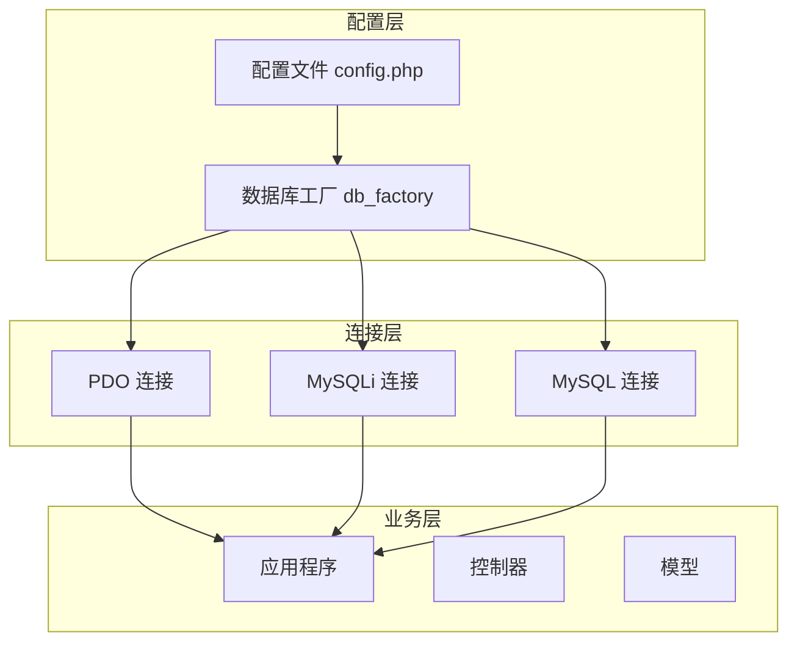
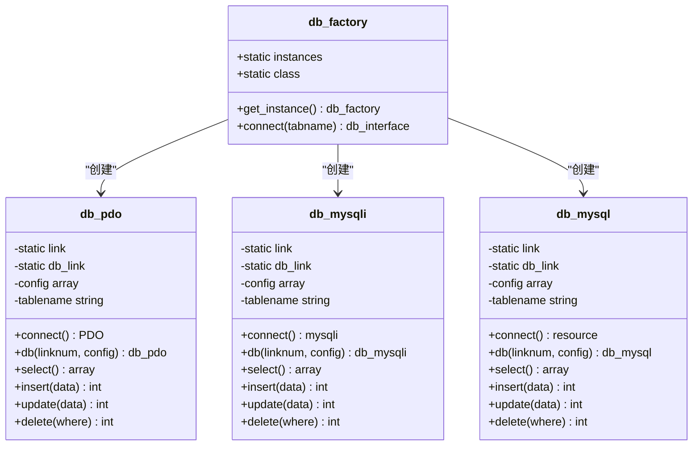
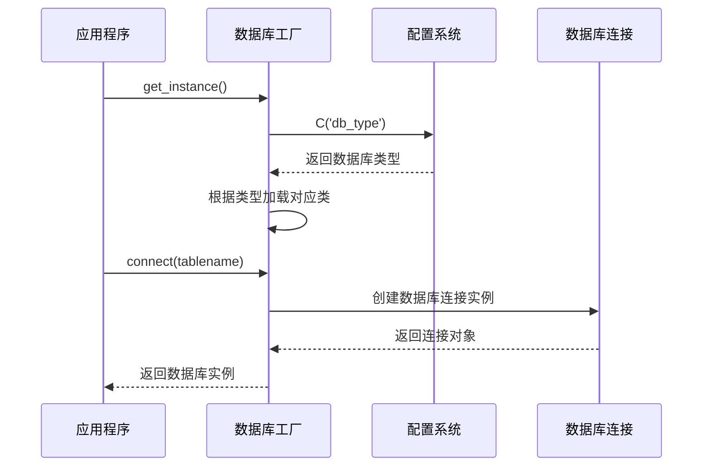
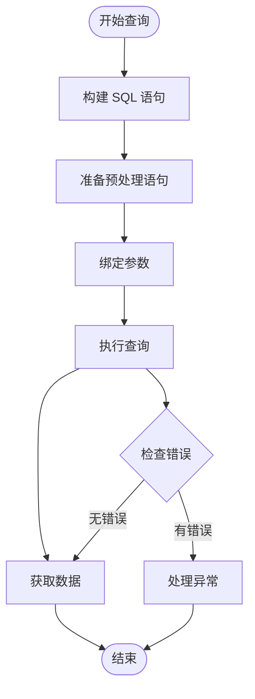
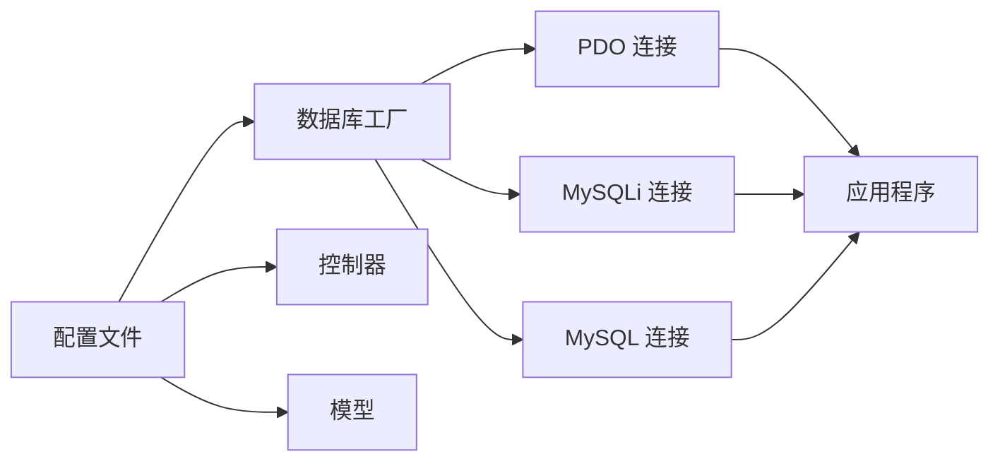
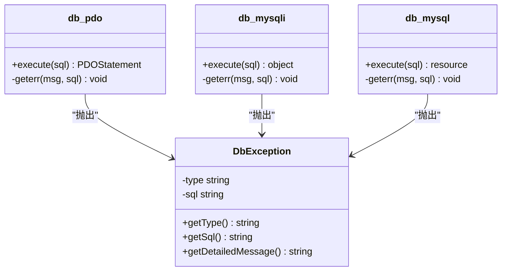
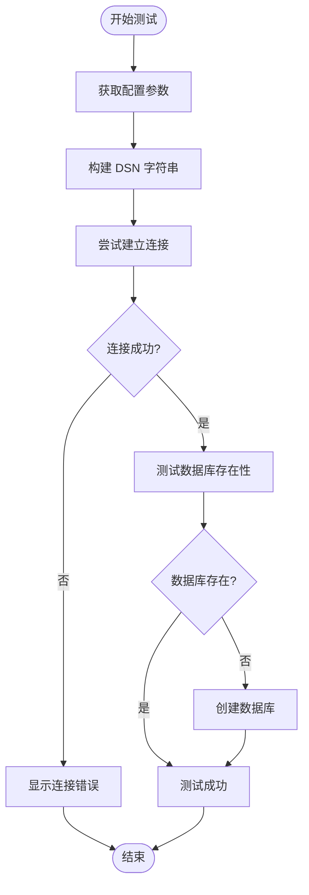

# 数据库配置

<cite>
**本文档引用的文件**
- [config.php](file://common/config/config.php)
- [db_factory.class.php](file://ryphp/core/class/db_factory.class.php)
- [db_pdo.class.php](file://ryphp/core/class/db_pdo.class.php)
- [db_pdo_optimized.class.php](file://ryphp/core/class/db_pdo_optimized.class.php)
- [db_mysqli.class.php](file://ryphp/core/class/db_mysqli.class.php)
- [db_mysql.class.php](file://ryphp/core/class/db_mysql.class.php)
- [DbException.class.php](file://ryphp/core/class/DbException.class.php)
- [index.php](file://application/install/index.php)
- [s3.php](file://application/install/templates/s3.php)
</cite>

## 目录
1. [简介](#简介)
2. [项目结构](#项目结构)
3. [核心组件](#核心组件)
4. [架构概览](#架构概览)
5. [详细组件分析](#详细组件分析)
6. [依赖关系分析](#依赖关系分析)
7. [性能考量](#性能考量)
8. [故障排除指南](#故障排除指南)
9. [结论](#结论)

## 简介
本文档详细介绍 LRYBlog 的数据库配置系统，涵盖数据库连接配置的各项参数、不同数据库类型的配置方法、性能优化建议以及安全考虑。LRYBlog 提供了三种数据库连接方式：PDO、MySQLi 和传统的 MySQL 扩展，每种方式都有其特点和适用场景。

## 项目结构
LRYBlog 的数据库配置系统采用模块化设计，主要由以下组件构成：

**图表来源**
- [config.php](file://common/config/config.php#L13-L21)
- [db_factory.class.php](file://ryphp/core/class/db_factory.class.php#L11-L34)

**章节来源**
- [config.php](file://common/config/config.php#L1-L88)
- [db_factory.class.php](file://ryphp/core/class/db_factory.class.php#L1-L50)

## 核心组件
LRYBlog 的数据库配置系统包含以下核心组件：

### 配置参数详解
系统提供了完整的数据库配置参数集合：

| 参数名称 | 默认值 | 说明 | 类型 |
|---------|--------|------|------|
| db_type | 'pdo' | 数据库连接扩展类型 | 字符串 |
| db_host | '127.0.0.1' | 数据库服务器地址 | 字符串 |
| db_name | 'rycms' | 数据库名称 | 字符串 |
| db_user | 'root' | 数据库用户名 | 字符串 |
| db_pwd | 'lrysql01.' | 数据库密码 | 字符串 |
| db_port | 3306 | 数据库端口号 | 整数 |
| db_charset | 'utf8' | 字符集设置 | 字符串 |
| db_prefix | 'rycms_' | 数据库表前缀 | 字符串 |

### 支持的数据库类型
系统支持三种数据库连接方式：

1. **PDO (推荐)**：现代、跨平台、功能丰富
2. **MySQLi**：MySQL 专有的改进版本
3. **MySQL**：传统 MySQL 扩展（已废弃）

**章节来源**
- [config.php](file://common/config/config.php#L13-L21)

## 架构概览
LRYBlog 采用了工厂模式来管理不同的数据库连接类型：

**图表来源**
- [db_factory.class.php](file://ryphp/core/class/db_factory.class.php#L2-L34)
- [db_pdo.class.php](file://ryphp/core/class/db_pdo.class.php#L10-L31)
- [db_mysqli.class.php](file://ryphp/core/class/db_mysqli.class.php#L10-L28)
- [db_mysql.class.php](file://ryphp/core/class/db_mysql.class.php#L10-L28)

## 详细组件分析

### 数据库工厂类 (db_factory)
数据库工厂负责根据配置选择合适的数据库连接类型：

**图表来源**
- [db_factory.class.php](file://ryphp/core/class/db_factory.class.php#L11-L49)

### PDO 连接实现
PDO 是系统推荐的数据库连接方式，具有以下特点：

#### 连接参数配置
- **DNS 构建**：`mysql:host=主机;dbname=数据库;port=端口;charset=字符集`
- **PDO 属性设置**：
  - `PDO::ATTR_CASE`: 自然大小写
  - `PDO::ATTR_ERRMODE`: 异常模式
  - `PDO::ATTR_ORACLE_NULLS`: NULL 处理
  - `PDO::ATTR_STRINGIFY_FETCHES`: 字符串化
  - `PDO::ATTR_EMULATE_PREPARES`: 禁用模拟预处理

#### 预处理语句支持
PDO 实现了完整的预处理语句机制，提供 SQL 注入防护：

**图表来源**
- [db_pdo.class.php](file://ryphp/core/class/db_pdo.class.php#L100-L124)

**章节来源**
- [db_pdo.class.php](file://ryphp/core/class/db_pdo.class.php#L10-L646)

### MySQLi 连接实现
MySQLi 提供了面向对象和面向过程两种接口：

#### 主要特性
- **面向对象接口**：`new mysqli(host, user, password, database, port)`
- **字符集设置**：`set_charset()` 方法
- **原生预处理**：支持预处理语句
- **事务支持**：完整的事务管理

**章节来源**
- [db_mysqli.class.php](file://ryphp/core/class/db_mysqli.class.php#L10-L660)

### 传统 MySQL 连接
传统 MySQL 扩展已被 PHP 官方废弃，但仍被系统保留以兼容旧版本：

#### 主要限制
- 不支持预处理语句
- 不支持事务
- 已在 PHP 5.5.0 中标记为废弃
- 在 PHP 7.0.0 中完全移除

**章节来源**
- [db_mysql.class.php](file://ryphp/core/class/db_mysql.class.php#L10-L667)

## 依赖关系分析

### 配置依赖关系

**图表来源**
- [config.php](file://common/config/config.php#L13-L21)
- [db_factory.class.php](file://ryphp/core/class/db_factory.class.php#L38-L49)

### 异常处理机制
系统实现了统一的数据库异常处理机制：

**图表来源**
- [DbException.class.php](file://ryphp/core/class/DbException.class.php#L10-L73)
- [db_pdo.class.php](file://ryphp/core/class/db_pdo.class.php#L492-L505)

**章节来源**
- [DbException.class.php](file://ryphp/core/class/DbException.class.php#L1-L73)

## 性能考量

### 连接池管理
系统实现了数据库连接池机制，支持多连接管理：

| 特性 | PDO | MySQLi | MySQL |
|------|-----|--------|-------|
| 连接池 | ✅ 支持 | ✅ 支持 | ❌ 不支持 |
| 预处理语句 | ✅ 完整支持 | ✅ 部分支持 | ❌ 不支持 |
| 事务支持 | ✅ 完整支持 | ✅ 完整支持 | ✅ 部分支持 |
| 字符集处理 | ✅ 自动处理 | ✅ 手动设置 | ✅ 手动设置 |
| 异常处理 | ✅ 统一异常 | ✅ 统一异常 | ✅ 统一异常 |

### 性能优化建议

#### 1. 连接优化
- **使用持久连接**：在高并发场景下考虑使用持久连接
- **连接复用**：利用连接池减少连接开销
- **超时设置**：合理设置连接超时时间

#### 2. 查询优化
- **预处理语句**：优先使用预处理语句防止 SQL 注入
- **批量操作**：使用批量插入和批量更新
- **索引优化**：确保常用查询字段有适当索引

#### 3. 内存管理
- **及时释放**：查询完成后及时释放结果集
- **大结果集处理**：使用分页或流式处理大数据集

## 故障排除指南

### 连接测试流程
系统提供了完整的数据库连接测试机制：

**图表来源**
- [index.php](file://application/install/index.php#L118-L127)
- [s3.php](file://application/install/templates/s3.php#L142-L165)

### 常见连接问题及解决方案

#### 1. 连接超时
**症状**：连接建立缓慢或超时
**原因**：
- 网络延迟过高
- 数据库服务器负载过大
- 防火墙阻断

**解决方案**：
- 检查网络连通性
- 优化数据库服务器性能
- 配置防火墙规则

#### 2. 认证失败
**症状**：用户名或密码错误
**原因**：
- 凭据错误
- 用户权限不足
- 主机白名单限制

**解决方案**：
- 验证用户名和密码
- 检查用户权限设置
- 配置正确的主机访问规则

#### 3. 字符集问题
**症状**：中文乱码或字符集错误
**原因**：
- 字符集设置不匹配
- 数据库字符集配置错误

**解决方案**：
- 统一设置字符集为 utf8mb4
- 检查数据库和表的字符集设置

#### 4. 事务处理问题
**症状**：事务提交或回滚失败
**原因**：
- 事务嵌套错误
- 锁等待超时

**解决方案**：
- 正确使用事务边界
- 优化锁策略
- 设置合理的超时时间

**章节来源**
- [index.php](file://application/install/index.php#L118-L189)
- [s3.php](file://application/install/templates/s3.php#L142-L211)

## 结论
LRYBlog 的数据库配置系统提供了灵活、安全且高性能的数据库连接方案。通过工厂模式的设计，系统能够根据配置自动选择最适合的数据库连接方式。PDO 作为推荐的连接方式，提供了完整的预处理语句支持和异常处理机制。

### 最佳实践建议
1. **优先使用 PDO**：利用其丰富的功能和良好的安全性
2. **合理设置字符集**：使用 utf8mb4 支持完整的 Unicode 字符
3. **实施连接池管理**：在高并发场景下提高性能
4. **定期监控连接状态**：及时发现和解决连接问题
5. **备份配置文件**：确保配置变更可追溯

通过遵循这些指导原则，可以确保 LRYBlog 系统的数据库连接稳定可靠，为用户提供优质的使用体验。