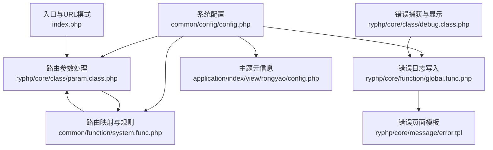
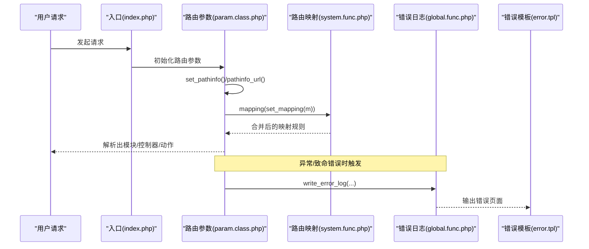
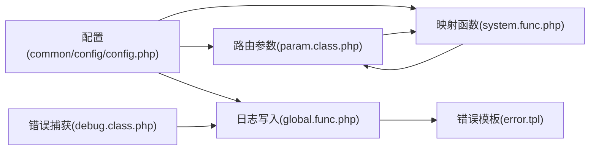

# 系统配置

<cite>
**本文引用的文件**
- [common/config/config.php](file://common/config/config.php)
- [ryphp/core/class/param.class.php](file://ryphp/core/class/param.class.php)
- [common/function/system.func.php](file://common/function/system.func.php)
- [ryphp/core/function/global.func.php](file://ryphp/core/function/global.func.php)
- [ryphp/core/class/debug.class.php](file://ryphp/core/class/debug.class.php)
- [ryphp/core/message/error.tpl](file://ryphp/core/message/error.tpl)
- [application/index/view/rongyao/config.php](file://application/index/view/rongyao/config.php)
- [index.php](file://index.php)
</cite>

## 目录
1. [简介](#简介)
2. [项目结构](#项目结构)
3. [核心配置项总览](#核心配置项总览)
4. [架构概览](#架构概览)
5. [详细配置项解析](#详细配置项解析)
6. [依赖关系分析](#依赖关系分析)
7. [性能与稳定性建议](#性能与稳定性建议)
8. [故障排查指南](#故障排查指南)
9. [结论](#结论)

## 简介
本文件面向LRYBlog系统管理员与开发者，系统性梳理并解释系统级配置项，重点覆盖：
- 安全与错误处理：系统密钥、错误页面与错误日志
- 主题与URL：站点主题、伪静态后缀、PATHINFO模式
- 路由体系：默认路由、路由映射与路由规则
并提供最佳实践与注意事项，帮助在不同部署环境（Apache/Nginx）与业务场景下稳定运行。

## 项目结构
与系统配置直接相关的核心位置如下：
- 系统配置入口：common/config/config.php
- 路由解析与PATHINFO处理：ryphp/core/class/param.class.php
- 路由映射与规则合并：common/function/system.func.php
- 错误日志写入：ryphp/core/function/global.func.php
- 错误页面模板：ryphp/core/message/error.tpl
- 主题元信息：application/index/view/rongyao/config.php
- URL模式常量：index.php

图表来源
- [common/config/config.php](file://common/config/config.php#L3-L30)
- [ryphp/core/class/param.class.php](file://ryphp/core/class/param.class.php#L7-L15)
- [common/function/system.func.php](file://common/function/system.func.php#L472-L505)
- [ryphp/core/function/global.func.php](file://ryphp/core/function/global.func.php#L835-L858)
- [ryphp/core/class/debug.class.php](file://ryphp/core/class/debug.class.php#L46-L94)
- [ryphp/core/message/error.tpl](file://ryphp/core/message/error.tpl#L1-L179)
- [application/index/view/rongyao/config.php](file://application/index/view/rongyao/config.php#L1-L29)
- [index.php](file://index.php#L15-L16)

章节来源
- [common/config/config.php](file://common/config/config.php#L3-L30)
- [ryphp/core/class/param.class.php](file://ryphp/core/class/param.class.php#L7-L15)
- [common/function/system.func.php](file://common/function/system.func.php#L472-L505)
- [ryphp/core/function/global.func.php](file://ryphp/core/function/global.func.php#L835-L858)
- [ryphp/core/class/debug.class.php](file://ryphp/core/class/debug.class.php#L46-L94)
- [ryphp/core/message/error.tpl](file://ryphp/core/message/error.tpl#L1-L179)
- [application/index/view/rongyao/config.php](file://application/index/view/rongyao/config.php#L1-L29)
- [index.php](file://index.php#L15-L16)

## 核心配置项总览
- 系统密钥：auth_key
- 错误页面：error_page
- 错误日志：error_log_save
- 站点主题：site_theme
- URL伪静态后缀：url_html_suffix
- PATHINFO模式：set_pathinfo
- 路由配置：route_config、route_mapping、route_rules

章节来源
- [common/config/config.php](file://common/config/config.php#L6-L11)
- [common/config/config.php](file://common/config/config.php#L24-L29)

## 架构概览
系统配置通过配置文件集中管理，运行时由入口文件加载并传递给各组件：
- URL模式常量决定路由参数处理策略
- 路由参数类负责解析PATHINFO、移除伪静态后缀、应用映射规则
- 路由映射函数从缓存与数据库生成映射规则并与全局规则合并
- 错误日志写入受开关控制，错误页面模板在非调试模式下统一呈现

图表来源
- [index.php](file://index.php#L15-L16)
- [ryphp/core/class/param.class.php](file://ryphp/core/class/param.class.php#L7-L15)
- [common/function/system.func.php](file://common/function/system.func.php#L486-L505)
- [ryphp/core/function/global.func.php](file://ryphp/core/function/global.func.php#L835-L858)
- [ryphp/core/message/error.tpl](file://ryphp/core/message/error.tpl#L1-L179)

## 详细配置项解析

### 系统密钥（auth_key）
- 作用：用于系统内部加密/签名等安全用途
- 默认值：配置文件中提供固定值
- 实际部署建议：
  - 安装阶段会随机生成新密钥并写回配置文件
  - 生产环境务必确保配置文件权限安全，避免泄露
- 关联流程：安装器在安装时会随机生成并替换该值

章节来源
- [common/config/config.php](file://common/config/config.php#L6-L7)
- [application/install/index.php](file://application/install/index.php#L321-L335)

### 错误页面（error_page）
- 作用：非调试模式下统一展示错误页面
- 默认值：404.html
- 注意事项：
  - 仅在非调试模式生效
  - 页面应放置于可公开访问的静态资源目录
- 关联流程：错误捕获后在非调试模式下渲染错误页面模板

章节来源
- [common/config/config.php](file://common/config/config.php#L7-L8)
- [ryphp/core/class/debug.class.php](file://ryphp/core/class/debug.class.php#L56-L65)
- [ryphp/core/message/error.tpl](file://ryphp/core/message/error.tpl#L1-L179)

### 错误日志（error_log_save）
- 作用：是否保存系统错误日志
- 默认值：1（开启）
- 行为特征：
  - 写入时间、请求URL、客户端IP、POST数据（如有）、错误详情
  - 自动创建日志目录，超过阈值自动备份
- 关联流程：错误捕获与致命错误均会调用日志写入函数

章节来源
- [common/config/config.php](file://common/config/config.php#L8-L8)
- [ryphp/core/function/global.func.php](file://ryphp/core/function/global.func.php#L835-L858)
- [ryphp/core/class/debug.class.php](file://ryphp/core/class/debug.class.php#L56-L65)

### 站点主题（site_theme）
- 作用：指定默认主题目录名
- 默认值：rongyao
- 主题元信息：主题目录下的元信息文件声明了分类/列表/内容页模板集合
- 应用场景：后台可按站点维度覆盖主题；前台渲染依据主题模板

章节来源
- [common/config/config.php](file://common/config/config.php#L9-L9)
- [application/index/view/rongyao/config.php](file://application/index/view/rongyao/config.php#L1-L29)

### URL伪静态后缀（url_html_suffix）
- 作用：生成/解析URL时附加的伪静态后缀
- 默认值：.html
- 影响范围：URL生成与PATHINFO解析阶段都会移除该后缀

章节来源
- [common/config/config.php](file://common/config/config.php#L10-L10)
- [ryphp/core/class/param.class.php](file://ryphp/core/class/param.class.php#L100-L100)

### PATHINFO模式（set_pathinfo）
- 作用：启用PATHINFO模式以兼容Nginx等服务器
- 默认值：false
- 工作原理：
  - 当URL模式启用时，若开启此开关，系统会从REQUEST_URI中提取PATH_INFO
  - 解析时先移除伪静态后缀与脚本名，再进行路由映射与参数拆分

章节来源
- [common/config/config.php](file://common/config/config.php#L11-L11)
- [ryphp/core/class/param.class.php](file://ryphp/core/class/param.class.php#L173-L183)
- [ryphp/core/class/param.class.php](file://ryphp/core/class/param.class.php#L95-L116)

### 路由配置（route_config）
- 作用：定义默认路由（模块/控制器/动作）
- 默认值：默认指向index模块的index控制器init动作
- 扩展能力：支持按域名维度覆盖默认路由

章节来源
- [common/config/config.php](file://common/config/config.php#L24-L26)
- [ryphp/core/class/param.class.php](file://ryphp/core/class/param.class.php#L7-L10)

### 路由映射（route_mapping）
- 作用：是否启用路由映射
- 默认值：true
- 工作机制：解析PATHINFO前，将路径按映射规则重写，再拆分为m/c/a及额外键值对

章节来源
- [common/config/config.php](file://common/config/config.php#L27-L27)
- [ryphp/core/class/param.class.php](file://ryphp/core/class/param.class.php#L101-L101)

### 路由规则（route_rules）
- 作用：全局自定义路由规则，与映射规则合并
- 默认值：空数组
- 合并顺序：映射规则优先，再与全局规则合并

章节来源
- [common/config/config.php](file://common/config/config.php#L29-L29)
- [common/function/system.func.php](file://common/function/system.func.php#L500-L504)

## 依赖关系分析
- 配置文件是路由与日志行为的唯一权威来源
- 路由参数类依赖配置中的URL后缀、映射开关与默认路由
- 路由映射函数依赖站点信息与数据库规则，最终与全局规则合并
- 错误日志写入受配置开关控制，错误捕获在异常/致命错误时触发

图表来源
- [common/config/config.php](file://common/config/config.php#L3-L30)
- [ryphp/core/class/param.class.php](file://ryphp/core/class/param.class.php#L7-L15)
- [common/function/system.func.php](file://common/function/system.func.php#L472-L505)
- [ryphp/core/function/global.func.php](file://ryphp/core/function/global.func.php#L835-L858)
- [ryphp/core/class/debug.class.php](file://ryphp/core/class/debug.class.php#L46-L94)
- [ryphp/core/message/error.tpl](file://ryphp/core/message/error.tpl#L1-L179)

## 性能与稳定性建议
- 安全配置
  - 生产环境务必更换默认系统密钥，确保配置文件权限仅限Web进程读取
- 错误日志
  - 开启日志保存有助于问题定位；注意定期清理与监控日志文件大小
- URL与路由
  - Nginx部署时如需PATHINFO模式，需将set_pathinfo设为true，并在服务器层正确转发PATH_INFO
  - 合理设置url_html_suffix，避免与真实静态文件冲突
  - 路由映射开启可提升SEO友好度，但需保证映射规则与站点结构一致
- 主题
  - 主题切换建议在后台完成，避免直接修改配置导致模板缺失

[本节为通用建议，无需具体文件引用]

## 故障排查指南
- 无法访问伪静态页面
  - 检查url_html_suffix与服务器rewrite规则是否一致
  - 若使用Nginx，确认已开启PATHINFO模式（set_pathinfo）
- 错误页面未显示或报错
  - 确认非调试模式下error_page路径正确
  - 检查error_log_save是否开启，日志文件是否可写
- 路由解析异常
  - 检查route_mapping与route_rules是否合理
  - 清理映射缓存后重试（映射规则来源于缓存与数据库）

章节来源
- [ryphp/core/class/param.class.php](file://ryphp/core/class/param.class.php#L95-L116)
- [ryphp/core/function/global.func.php](file://ryphp/core/function/global.func.php#L835-L858)
- [ryphp/core/class/debug.class.php](file://ryphp/core/class/debug.class.php#L56-L65)

## 结论
通过对系统配置项的逐项解析与流程梳理，可以明确：
- 安全与可观测性：auth_key与error_log_save构成基础防线
- 可用性与SEO：url_html_suffix与route_mapping提升用户体验
- 可维护性：route_config与route_rules提供灵活的路由治理
建议在生产环境中结合部署环境与业务需求，审慎调整上述配置，并建立完善的变更与巡检机制。