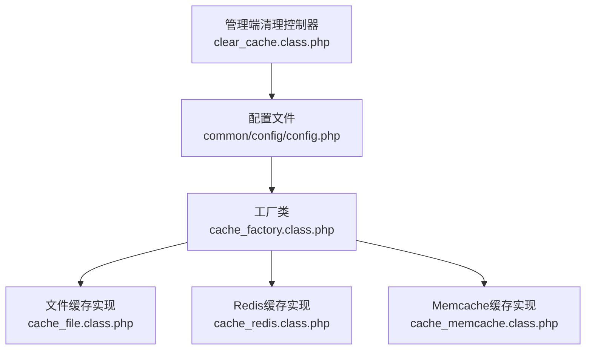
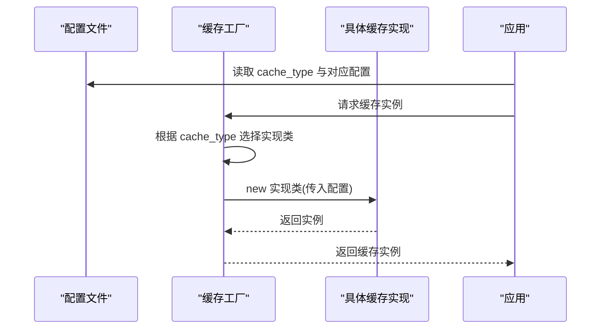
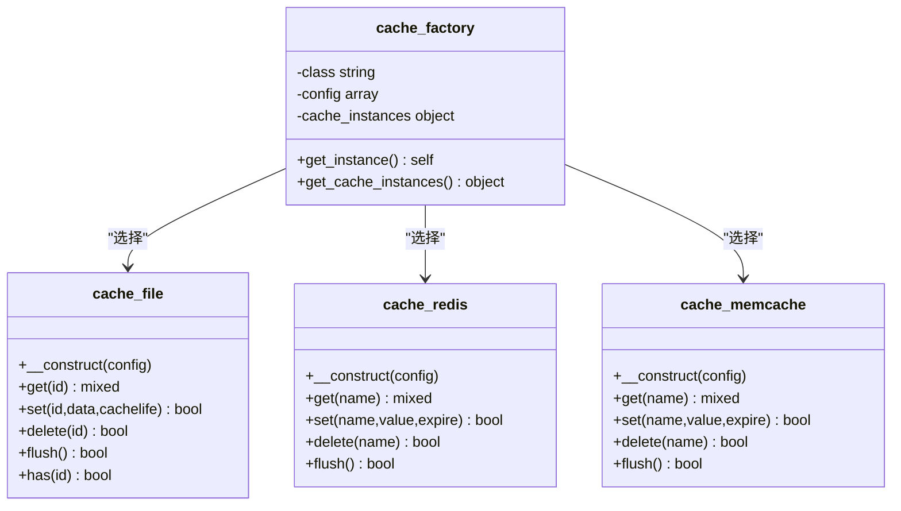
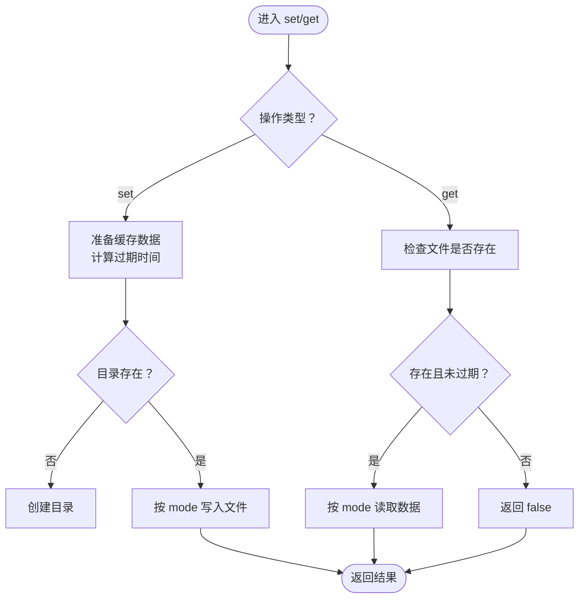
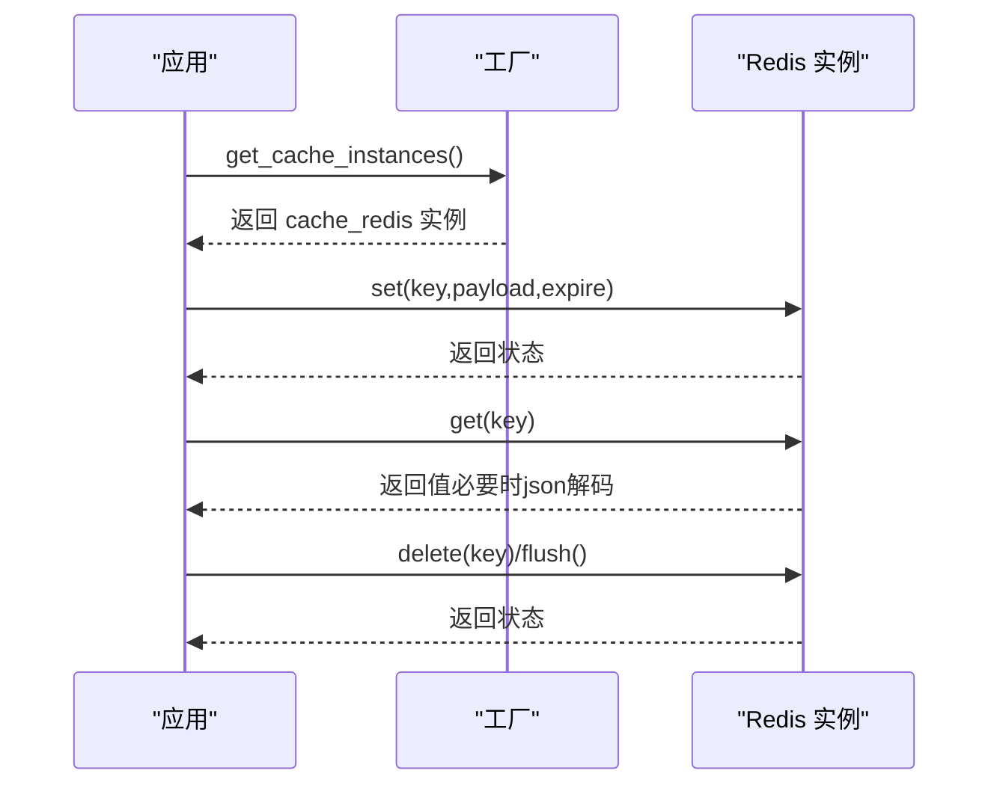
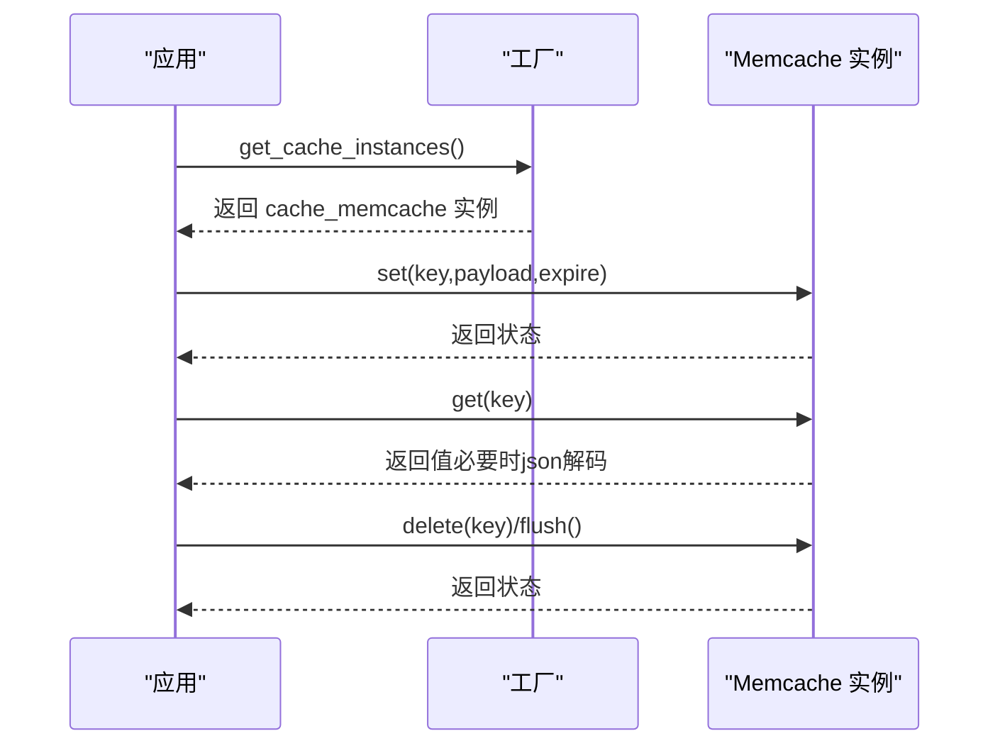
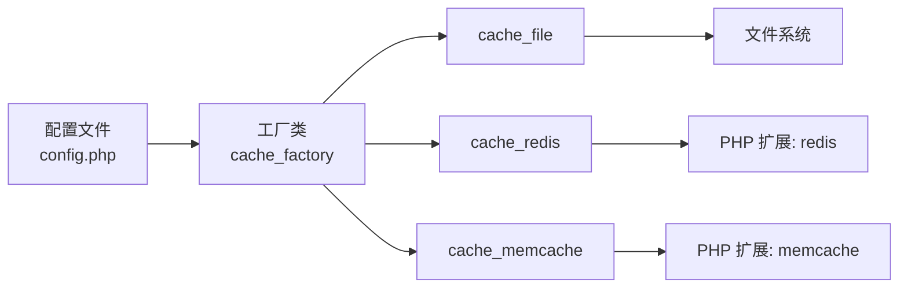

# 缓存配置

<cite>
**本文引用的文件**
- [common/config/config.php](file://common/config/config.php)
- [ryphp/core/class/cache_factory.class.php](file://ryphp/core/class/cache_factory.class.php)
- [ryphp/core/class/cache_file.class.php](file://ryphp/core/class/cache_file.class.php)
- [ryphp/core/class/cache_redis.class.php](file://ryphp/core/class/cache_redis.class.php)
- [ryphp/core/class/cache_memcache.class.php](file://ryphp/core/class/cache_memcache.class.php)
- [application/lry_admin_center/controller/clear_cache.class.php](file://application/lry_admin_center/controller/clear_cache.class.php)
- [ryphp/ryphp.php](file://ryphp/ryphp.php)
</cite>

## 目录
1. [引言](#引言)
2. [项目结构](#项目结构)
3. [核心组件](#核心组件)
4. [架构总览](#架构总览)
5. [详细组件分析](#详细组件分析)
6. [依赖关系分析](#依赖关系分析)
7. [性能考量与选型建议](#性能考量与选型建议)
8. [故障排除指南](#故障排除指南)
9. [结论](#结论)

## 引言
本文件面向 LRYBlog 的缓存配置，围绕缓存类型（cache_type）的选择与适用场景展开，系统梳理文件缓存（file_config）、Redis 缓存（redis_config）与 Memcache 缓存（memcache_config）的配置要点，并结合工厂类与具体实现类，给出配置优化策略与常见问题排查方法。读者无需深入底层即可正确配置与维护缓存。

## 项目结构
与缓存配置直接相关的文件分布如下：
- 配置文件：common/config/config.php 提供全局缓存类型与三类缓存的默认配置
- 工厂类：ryphp/core/class/cache_factory.class.php 根据配置动态加载对应缓存实现
- 实现类：cache_file.class.php、cache_redis.class.php、cache_memcache.class.php 分别实现三种缓存
- 管理端清理：application/lry_admin_center/controller/clear_cache.class.php 展示了缓存目录清理逻辑
- 框架入口：ryphp/ryphp.php 定义系统常量与加载机制，为缓存加载提供基础

图表来源
- [common/config/config.php](file://common/config/config.php#L39-L66)
- [ryphp/core/class/cache_factory.class.php](file://ryphp/core/class/cache_factory.class.php#L36-L82)
- [ryphp/core/class/cache_file.class.php](file://ryphp/core/class/cache_file.class.php#L1-L130)
- [ryphp/core/class/cache_redis.class.php](file://ryphp/core/class/cache_redis.class.php#L1-L108)
- [ryphp/core/class/cache_memcache.class.php](file://ryphp/core/class/cache_memcache.class.php#L1-L91)
- [application/lry_admin_center/controller/clear_cache.class.php](file://application/lry_admin_center/controller/clear_cache.class.php#L1-L25)

章节来源
- [common/config/config.php](file://common/config/config.php#L39-L66)
- [ryphp/core/class/cache_factory.class.php](file://ryphp/core/class/cache_factory.class.php#L36-L82)
- [ryphp/core/class/cache_file.class.php](file://ryphp/core/class/cache_file.class.php#L1-L130)
- [ryphp/core/class/cache_redis.class.php](file://ryphp/core/class/cache_redis.class.php#L1-L108)
- [ryphp/core/class/cache_memcache.class.php](file://ryphp/core/class/cache_memcache.class.php#L1-L91)
- [application/lry_admin_center/controller/clear_cache.class.php](file://application/lry_admin_center/controller/clear_cache.class.php#L1-L25)
- [ryphp/ryphp.php](file://ryphp/ryphp.php#L108-L140)

## 核心组件
- 缓存类型与默认值：cache_type 默认为 file；当未配置或无效时，工厂类默认回退到 file
- 文件缓存（file_config）：支持缓存目录、文件后缀、序列化模式等
- Redis 缓存（redis_config）：支持 host、port、password、select、timeout、expire、persistent、prefix
- Memcache 缓存（memcache_config）：支持 host、port、timeout、expire、persistent、prefix
- 工厂类：根据 cache_type 动态加载对应实现类并注入配置
- 清理流程：管理端提供缓存目录清理能力，便于运维排障

章节来源
- [common/config/config.php](file://common/config/config.php#L39-L66)
- [ryphp/core/class/cache_factory.class.php](file://ryphp/core/class/cache_factory.class.php#L36-L82)
- [ryphp/core/class/cache_file.class.php](file://ryphp/core/class/cache_file.class.php#L1-L130)
- [ryphp/core/class/cache_redis.class.php](file://ryphp/core/class/cache_redis.class.php#L1-L108)
- [ryphp/core/class/cache_memcache.class.php](file://ryphp/core/class/cache_memcache.class.php#L1-L91)
- [application/lry_admin_center/controller/clear_cache.class.php](file://application/lry_admin_center/controller/clear_cache.class.php#L9-L24)

## 架构总览
缓存配置通过配置文件集中管理，工厂类依据配置决定加载哪一种缓存实现，并在首次使用时实例化该实现。文件缓存以磁盘文件形式存储，Redis/Memcache 将键值对存储于内存数据库中，具备更高的读写性能与并发能力。

图表来源
- [common/config/config.php](file://common/config/config.php#L39-L66)
- [ryphp/core/class/cache_factory.class.php](file://ryphp/core/class/cache_factory.class.php#L36-L82)

## 详细组件分析

### 工厂类与加载机制
- 工厂类采用单例 + 延迟加载模式，首次请求时根据 cache_type 决定加载 cache_file、cache_redis 或 cache_memcache，并将配置注入对应实现类
- 若 cache_type 未配置或不在支持列表中，默认回退到 file 实现

图表来源
- [ryphp/core/class/cache_factory.class.php](file://ryphp/core/class/cache_factory.class.php#L36-L82)
- [ryphp/core/class/cache_file.class.php](file://ryphp/core/class/cache_file.class.php#L1-L130)
- [ryphp/core/class/cache_redis.class.php](file://ryphp/core/class/cache_redis.class.php#L1-L108)
- [ryphp/core/class/cache_memcache.class.php](file://ryphp/core/class/cache_memcache.class.php#L1-L91)

章节来源
- [ryphp/core/class/cache_factory.class.php](file://ryphp/core/class/cache_factory.class.php#L36-L82)

### 文件缓存（cache_file）
- 关键配置项
  - cache_dir：缓存文件目录（默认位于 RYPHP_ROOT/cache/cache_file/）
  - suffix：缓存文件后缀（默认 .cache.php）
  - mode：序列化模式
    - 1：使用 serialize 序列化，文件头部带保护标记
    - 2：以可执行数组形式写入文件，读取时 require 返回数组
- 存取流程
  - set：计算过期时间，按 mode 写入文件；若目录不存在则自动创建
  - get：先判断是否存在且未过期，再按 mode 读取
  - delete：删除指定文件
  - flush：遍历目录下所有缓存文件并逐个删除
  - has：判断文件是否存在

图表来源
- [ryphp/core/class/cache_file.class.php](file://ryphp/core/class/cache_file.class.php#L34-L128)

章节来源
- [ryphp/core/class/cache_file.class.php](file://ryphp/core/class/cache_file.class.php#L1-L130)

### Redis 缓存（cache_redis）
- 关键配置项
  - host/port：服务地址与端口
  - password：认证密码（为空表示无密码）
  - select：选择数据库编号
  - timeout：连接超时（秒）
  - expire：默认过期时间（秒），0 表示永不过期
  - persistent：是否启用持久连接
  - prefix：键名前缀
- 存取流程
  - set：若 expire 为 0 使用 set，否则使用 setex；数组类型会先 json 编码
  - get：先加前缀，再取值；尝试 json 解码为数组
  - delete/flush：删除单键或清空数据库

图表来源
- [ryphp/core/class/cache_redis.class.php](file://ryphp/core/class/cache_redis.class.php#L30-L105)

章节来源
- [ryphp/core/class/cache_redis.class.php](file://ryphp/core/class/cache_redis.class.php#L1-L108)

### Memcache 缓存（cache_memcache）
- 关键配置项
  - host/port：服务地址与端口
  - timeout：连接超时（秒）
  - expire：默认过期时间（秒）
  - persistent：是否启用持久连接
  - prefix：键名前缀
- 存取流程
  - set：数组类型先 json 编码，再以指定过期时间写入
  - get：先加前缀，再取值；尝试 json 解码为数组
  - delete/flush：删除单键或清空

图表来源
- [ryphp/core/class/cache_memcache.class.php](file://ryphp/core/class/cache_memcache.class.php#L27-L89)

章节来源
- [ryphp/core/class/cache_memcache.class.php](file://ryphp/core/class/cache_memcache.class.php#L1-L91)

### 配置项详解与适用场景
- cache_type：选择缓存类型（file、redis、memcache）。默认 file；当未配置或无效时回退 file
- file_config
  - cache_dir：缓存文件存放目录（默认位于 RYPHP_ROOT/cache/cache_file/）
  - suffix：缓存文件后缀（默认 .cache.php）
  - mode：序列化模式（1=serialize；2=可执行数组文件）
  - 适用场景：开发环境、小规模站点、无需跨进程共享缓存
- redis_config
  - host/port/password/select/timeout/expire/persistent/prefix：与 Redis 客户端一致的连接与行为参数
  - 适用场景：高并发、需要过期控制与持久连接的生产环境
- memcache_config
  - host/port/timeout/expire/persistent/prefix：与 Memcache 客户端一致的连接与行为参数
  - 适用场景：轻量级内存缓存、对 Redis 有部署限制的环境

章节来源
- [common/config/config.php](file://common/config/config.php#L39-L66)
- [ryphp/core/class/cache_file.class.php](file://ryphp/core/class/cache_file.class.php#L6-L14)
- [ryphp/core/class/cache_redis.class.php](file://ryphp/core/class/cache_redis.class.php#L13-L22)
- [ryphp/core/class/cache_memcache.class.php](file://ryphp/core/class/cache_memcache.class.php#L13-L20)

## 依赖关系分析
- 配置依赖：工厂类依赖配置文件中的 cache_type 与对应配置数组
- 实现依赖：各实现类依赖 PHP 扩展（redis/memcache）或文件系统
- 加载依赖：框架通过 load_sys_class 动态加载类文件

图表来源
- [common/config/config.php](file://common/config/config.php#L39-L66)
- [ryphp/core/class/cache_factory.class.php](file://ryphp/core/class/cache_factory.class.php#L36-L82)
- [ryphp/core/class/cache_file.class.php](file://ryphp/core/class/cache_file.class.php#L1-L130)
- [ryphp/core/class/cache_redis.class.php](file://ryphp/core/class/cache_redis.class.php#L31-L33)
- [ryphp/core/class/cache_memcache.class.php](file://ryphp/core/class/cache_memcache.class.php#L28-L30)

章节来源
- [ryphp/core/class/cache_factory.class.php](file://ryphp/core/class/cache_factory.class.php#L36-L82)
- [ryphp/ryphp.php](file://ryphp/ryphp.php#L108-L140)

## 性能考量与选型建议
- 文件缓存（file）
  - 优点：部署简单、无需额外服务
  - 缺点：随机 IO、锁竞争、无法跨进程共享
  - 建议：小流量站点或开发测试；注意目录权限与 mode 选择
- Redis
  - 优点：高性能、原子操作、过期控制、持久连接
  - 缺点：需要部署 Redis 服务
  - 建议：生产环境首选；合理设置 expire 与 prefix，避免键冲突
- Memcache
  - 优点：轻量、易部署
  - 缺点：功能相对简单，无持久化
  - 建议：对 Redis 有部署限制时的替代方案

[本节为通用建议，不直接分析具体文件，故无章节来源]

## 故障排除指南
- 缓存目录不可写
  - 现象：清理缓存时报错，提示 cache 目录不可写
  - 处理：确认 RYPHP_ROOT/cache 及子目录具有写权限
- Redis 扩展缺失
  - 现象：实例化失败并提示不支持 redis
  - 处理：安装并启用 PHP redis 扩展
- Memcache 扩展缺失
  - 现象：实例化失败并提示不支持 memcache
  - 处理：安装并启用 PHP memcache 扩展
- 缓存键冲突或命名混乱
  - 现象：读取到错误数据或覆盖预期键
  - 处理：为不同业务设置独立 prefix，避免 key 命名重复
- 过期时间异常
  - 现象：缓存未按预期过期
  - 处理：核对 expire 配置与 set 时传入的过期时间；Redis 使用 setex 时注意单位为秒
- 文件缓存 mode 选择不当
  - 现象：读取失败或数据异常
  - 处理：确保 mode 与写入时一致；mode 2 读取时使用 require，需保证文件内容合法

章节来源
- [application/lry_admin_center/controller/clear_cache.class.php](file://application/lry_admin_center/controller/clear_cache.class.php#L9-L24)
- [ryphp/core/class/cache_redis.class.php](file://ryphp/core/class/cache_redis.class.php#L31-L33)
- [ryphp/core/class/cache_memcache.class.php](file://ryphp/core/class/cache_memcache.class.php#L28-L30)
- [ryphp/core/class/cache_file.class.php](file://ryphp/core/class/cache_file.class.php#L103-L128)

## 结论
- 通过配置文件集中管理缓存类型与参数，配合工厂类实现按需加载，使系统具备良好的可替换性
- 文件缓存适合小规模场景；Redis/Memcache 更适合高并发与跨进程共享需求
- 合理设置过期时间、前缀与持久连接，有助于提升性能与稳定性
- 日常运维中应关注目录权限、扩展可用性与键命名规范，以降低故障概率