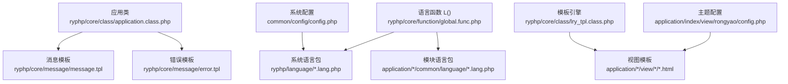
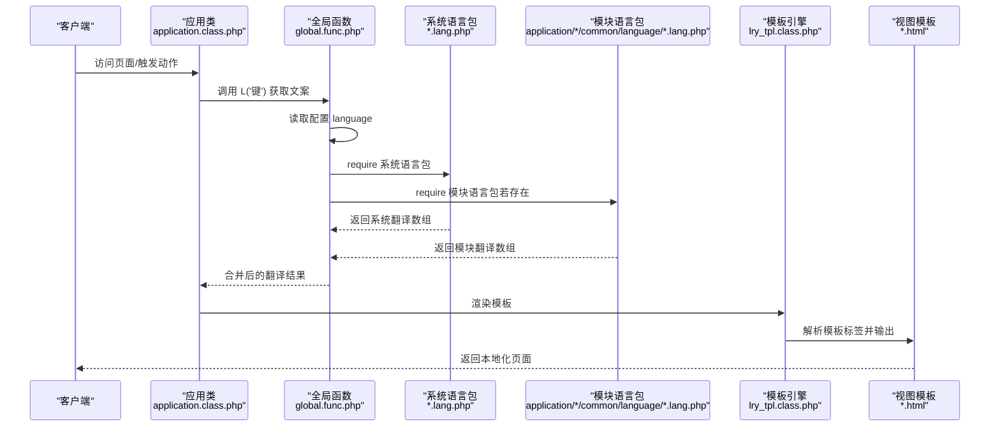
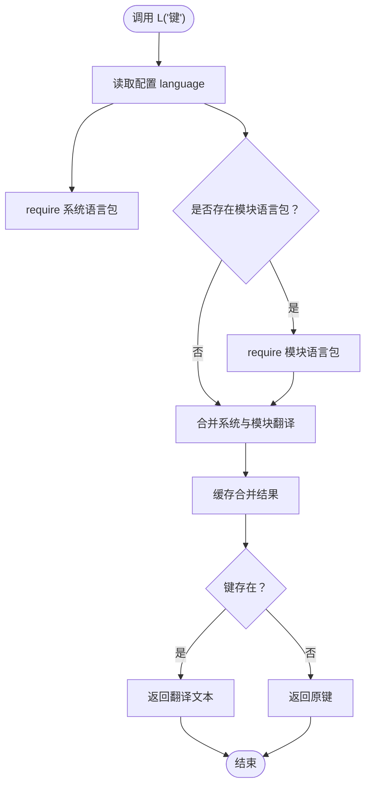
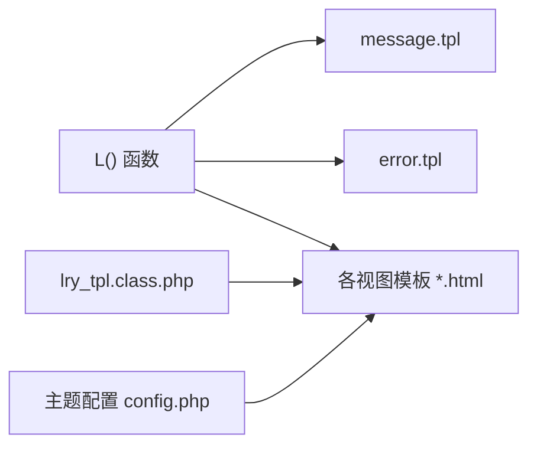
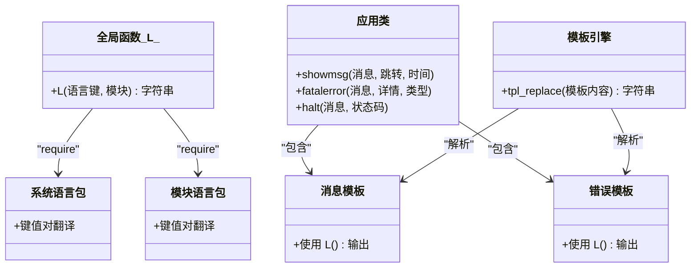
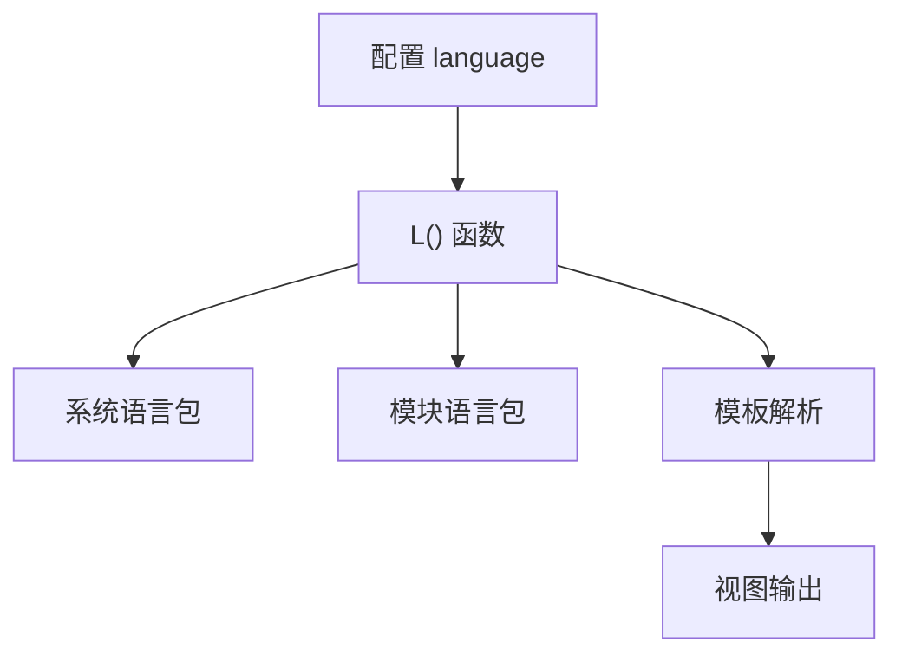

# 语言配置

<cite>
**本文引用的文件**
- [config.php](file://common/config/config.php)
- [zh_cn.lang.php](file://ryphp/language/zh_cn.lang.php)
- [en_us.lang.php](file://ryphp/language/en_us.lang.php)
- [global.func.php](file://ryphp/core/function/global.func.php)
- [message.tpl](file://ryphp/core/message/message.tpl)
- [error.tpl](file://ryphp/core/message/error.tpl)
- [application.class.php](file://ryphp/core/class/application.class.php)
- [lry_tpl.class.php](file://ryphp/core/class/lry_tpl.class.php)
- [config.php](file://application/index/view/rongyao/config.php)
</cite>

## 目录
1. [简介](#简介)
2. [项目结构](#项目结构)
3. [核心组件](#核心组件)
4. [架构总览](#架构总览)
5. [详细组件分析](#详细组件分析)
6. [依赖分析](#依赖分析)
7. [性能考虑](#性能考虑)
8. [故障排查指南](#故障排查指南)
9. [结论](#结论)
10. [附录](#附录)

## 简介
本文件系统性梳理 LRYBlog 的语言配置与国际化机制，重点覆盖：
- 系统语言配置项与可用语言（简体中文 zh_cn、美式英语 en_us）
- 语言包组织结构与加载流程
- 多语言环境下模板与内容的国际化处理
- 语言切换的实现方式与配置步骤
- 扩展新语言支持的方法与注意事项
- 语言配置与模板系统的集成关系及最佳实践

## 项目结构
围绕语言配置的关键目录与文件如下：
- 语言包：ryphp/language/zh_cn.lang.php、ryphp/language/en_us.lang.php
- 系统配置：common/config/config.php（包含 language 选项）
- 全局函数：ryphp/core/function/global.func.php（包含 L() 语言函数与语言加载逻辑）
- 消息与错误模板：ryphp/core/message/message.tpl、ryphp/core/message/error.tpl
- 应用入口与消息展示：ryphp/core/class/application.class.php
- 模板引擎：ryphp/core/class/lry_tpl.class.php
- 主题配置：application/index/view/rongyao/config.php（模板映射）

**图表来源**
- [config.php](file://common/config/config.php#L72-L74)
- [global.func.php](file://ryphp/core/function/global.func.php#L335-L354)
- [application.class.php](file://ryphp/core/class/application.class.php#L77-L96)
- [message.tpl](file://ryphp/core/message/message.tpl#L1-L277)
- [error.tpl](file://ryphp/core/message/error.tpl#L1-L179)
- [lry_tpl.class.php](file://ryphp/core/class/lry_tpl.class.php#L1-L134)
- [config.php](file://application/index/view/rongyao/config.php#L1-L29)

**章节来源**
- [config.php](file://common/config/config.php#L72-L74)
- [global.func.php](file://ryphp/core/function/global.func.php#L335-L354)
- [application.class.php](file://ryphp/core/class/application.class.php#L77-L96)
- [message.tpl](file://ryphp/core/message/message.tpl#L1-L277)
- [error.tpl](file://ryphp/core/message/error.tpl#L1-L179)
- [lry_tpl.class.php](file://ryphp/core/class/lry_tpl.class.php#L1-L134)
- [config.php](file://application/index/view/rongyao/config.php#L1-L29)

## 核心组件
- 系统语言配置项
  - 在系统配置中通过 language 指定默认语言，支持 zh_cn 与 en_us。
- 语言函数 L()
  - 动态加载系统语言包与模块语言包，合并后按键查找翻译。
- 模板中的语言使用
  - 模板中通过 L('键') 的方式渲染国际化文案。
- 消息与错误页面
  - 消息提示与错误页面模板内也使用 L() 输出本地化文案。

**章节来源**
- [config.php](file://common/config/config.php#L72-L74)
- [global.func.php](file://ryphp/core/function/global.func.php#L335-L354)
- [message.tpl](file://ryphp/core/message/message.tpl#L9-L250)
- [error.tpl](file://ryphp/core/message/error.tpl#L167-L176)

## 架构总览
语言配置与模板系统的交互流程如下：

**图表来源**
- [application.class.php](file://ryphp/core/class/application.class.php#L77-L96)
- [global.func.php](file://ryphp/core/function/global.func.php#L335-L354)
- [lry_tpl.class.php](file://ryphp/core/class/lry_tpl.class.php#L31-L59)

## 详细组件分析

### 语言包组织与加载机制
- 语言包文件
  - 系统语言包：ryphp/language/zh_cn.lang.php、ryphp/language/en_us.lang.php
  - 模块语言包：application/{module}/common/language/{lang}.lang.php（按模块目录组织）
- 加载流程
  - 通过 L() 函数读取配置 language，require 对应系统语言包
  - 若存在 application/{module}/common/language/{lang}.lang.php，则 require 并与系统语言包合并
  - 以键值对形式缓存，后续直接从缓存取值
- 使用方式
  - 模板中使用 L('键') 输出对应语言文案
  - 控制器/模型中也可直接调用 L() 获取本地化文本

**图表来源**
- [global.func.php](file://ryphp/core/function/global.func.php#L335-L354)

**章节来源**
- [zh_cn.lang.php](file://ryphp/language/zh_cn.lang.php#L1-L52)
- [en_us.lang.php](file://ryphp/language/en_us.lang.php#L1-L52)
- [global.func.php](file://ryphp/core/function/global.func.php#L335-L354)

### 模板与内容的国际化处理
- 模板中的语言使用
  - 消息模板与错误模板均通过 L() 输出本地化文案，确保提示信息与错误页面符合当前语言
- 模板引擎
  - lry_tpl.class.php 负责解析模板标签，模板中可直接使用 L() 输出翻译
- 主题与模板映射
  - 主题配置文件定义了分类、列表、内容页模板映射，配合语言包实现页面文案本地化

**图表来源**
- [message.tpl](file://ryphp/core/message/message.tpl#L9-L250)
- [error.tpl](file://ryphp/core/message/error.tpl#L167-L176)
- [lry_tpl.class.php](file://ryphp/core/class/lry_tpl.class.php#L31-L59)
- [config.php](file://application/index/view/rongyao/config.php#L1-L29)

**章节来源**
- [message.tpl](file://ryphp/core/message/message.tpl#L1-L277)
- [error.tpl](file://ryphp/core/message/error.tpl#L1-L179)
- [lry_tpl.class.php](file://ryphp/core/class/lry_tpl.class.php#L1-L134)
- [config.php](file://application/index/view/rongyao/config.php#L1-L29)

### 语言切换的实现方式与配置步骤
- 默认语言配置
  - 在系统配置中设置 language 为 zh_cn 或 en_us
- 运行时切换（建议做法）
  - 在应用启动早期（如入口处）设置全局语言变量或通过会话/Cookie 传递语言标识
  - 重新加载语言包（调用 L() 触发 require 重新加载），或在业务层手动构造新的翻译数组
- 注意事项
  - 切换语言后需确保后续所有 L() 调用使用新语言包
  - 若采用模块语言包，需同时切换模块语言包路径
  - 前端页面的 lang 属性（如 message.tpl 的 <html lang="zh-CN">）可根据需要同步更新

**章节来源**
- [config.php](file://common/config/config.php#L72-L74)
- [global.func.php](file://ryphp/core/function/global.func.php#L335-L354)
- [message.tpl](file://ryphp/core/message/message.tpl#L2-L2)

### 扩展新语言支持的步骤与注意事项
- 新增语言包
  - 在 ryphp/language/ 下新增 {lang}.lang.php 文件，键值与现有语言包保持一致
- 模块语言包
  - 在 application/{module}/common/language/ 下新增同名语言包，用于模块级文案覆盖
- 验证与测试
  - 设置 language 为新语言，访问页面确认 L() 输出正确
  - 检查消息模板与错误模板是否正常显示
- 最佳实践
  - 保持键名一致性，避免硬编码中文/英文
  - 模块语言包优先级高于系统语言包，便于功能模块定制
  - 前端页面的 lang 属性与语言包保持一致，提升可读性与SEO友好性

**章节来源**
- [global.func.php](file://ryphp/core/function/global.func.php#L335-L354)
- [zh_cn.lang.php](file://ryphp/language/zh_cn.lang.php#L1-L52)
- [en_us.lang.php](file://ryphp/language/en_us.lang.php#L1-L52)

### 语言配置与模板系统的集成关系
- L() 函数作为统一入口，贯穿控制器、模型与模板
- 模板引擎负责解析模板标签，L() 在模板中直接生效
- 应用类在展示消息与错误页面时，同样使用 L() 输出本地化文案
- 主题配置文件定义模板映射，结合语言包实现页面级国际化

**图表来源**
- [global.func.php](file://ryphp/core/function/global.func.php#L335-L354)
- [application.class.php](file://ryphp/core/class/application.class.php#L77-L96)
- [lry_tpl.class.php](file://ryphp/core/class/lry_tpl.class.php#L31-L59)

**章节来源**
- [global.func.php](file://ryphp/core/function/global.func.php#L335-L354)
- [application.class.php](file://ryphp/core/class/application.class.php#L77-L96)
- [lry_tpl.class.php](file://ryphp/core/class/lry_tpl.class.php#L1-L134)

## 依赖分析
- 配置依赖
  - language 配置项决定默认语言包
- 运行时依赖
  - L() 依赖配置读取与文件 require
  - 模板依赖 L() 与模板引擎解析
- 潜在风险
  - 语言包缺失键会导致回退为原键
  - 模块语言包路径需与模块路由一致

**图表来源**
- [config.php](file://common/config/config.php#L72-L74)
- [global.func.php](file://ryphp/core/function/global.func.php#L335-L354)
- [lry_tpl.class.php](file://ryphp/core/class/lry_tpl.class.php#L31-L59)

**章节来源**
- [config.php](file://common/config/config.php#L72-L74)
- [global.func.php](file://ryphp/core/function/global.func.php#L335-L354)
- [lry_tpl.class.php](file://ryphp/core/class/lry_tpl.class.php#L1-L134)

## 性能考虑
- 语言包缓存
  - L() 内部使用静态数组缓存已加载的翻译，避免重复 require
- 模块语言包按需加载
  - 仅在存在模块语言包时才 require，减少不必要的 IO
- 模板解析
  - 模板引擎在编译阶段将标签替换为 PHP 输出，运行时只需执行已编译的 PHP 代码

**章节来源**
- [global.func.php](file://ryphp/core/function/global.func.php#L335-L354)
- [lry_tpl.class.php](file://ryphp/core/class/lry_tpl.class.php#L31-L59)

## 故障排查指南
- 问题：页面出现原键而非翻译
  - 排查：确认语言包中是否存在该键；确认模块语言包覆盖是否正确
- 问题：切换语言后部分文案未更新
  - 排查：确认是否在切换语言后重新加载语言包；检查 L() 调用是否在切换后执行
- 问题：错误页面未本地化
  - 排查：确认 error.tpl 中使用 L()；确认 fatalerror 流程是否正确包含模板

**章节来源**
- [global.func.php](file://ryphp/core/function/global.func.php#L335-L354)
- [application.class.php](file://ryphp/core/class/application.class.php#L93-L96)
- [error.tpl](file://ryphp/core/message/error.tpl#L167-L176)

## 结论
LRYBlog 的语言配置以简洁的键值对语言包为核心，通过 L() 函数实现系统与模块语言包的合并加载，并在模板与消息/错误页面中统一使用。通过合理组织语言包与遵循键名一致性，可在不改动模板结构的前提下实现多语言支持与灵活切换。建议在扩展新语言时保持键名一致与模块语言包的同步维护，以获得最佳的国际化体验。

## 附录
- 快速对照
  - 默认语言：zh_cn、en_us
  - 语言包位置：ryphp/language/*.lang.php
  - 模块语言包位置：application/*/common/language/*.lang.php
  - 模板中使用：L('键')
  - 切换语言：修改配置或运行时重载语言包