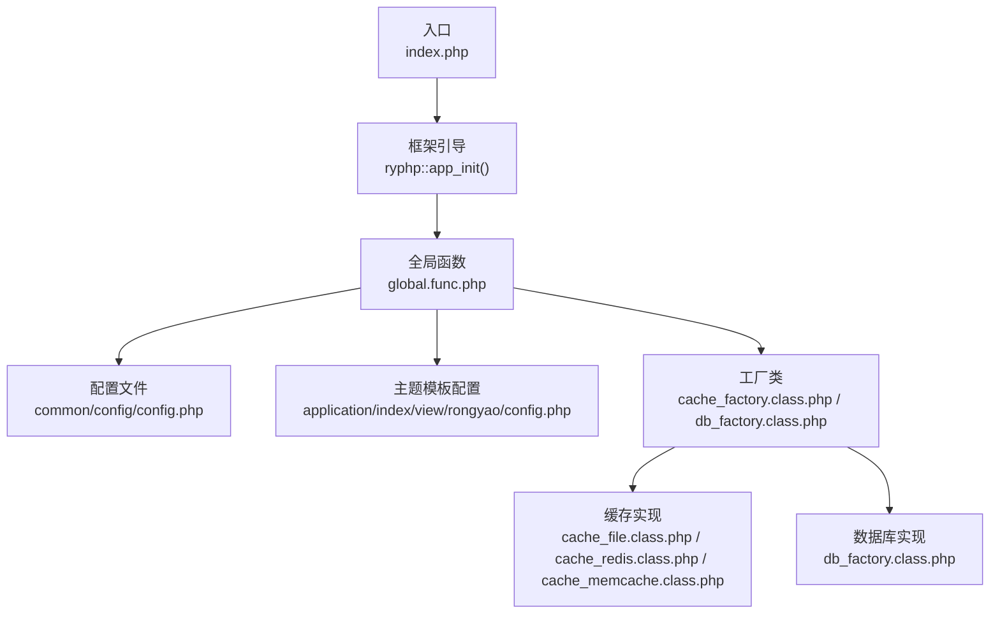
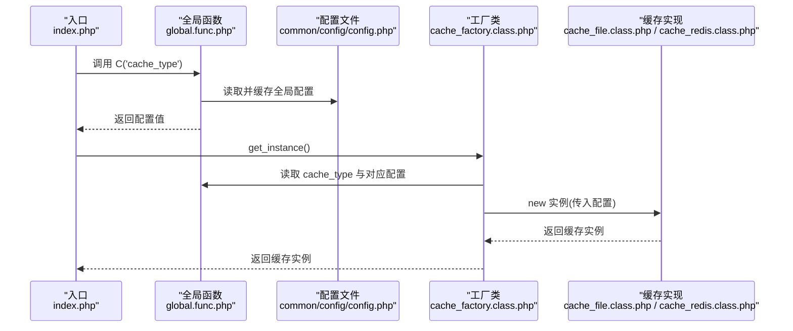
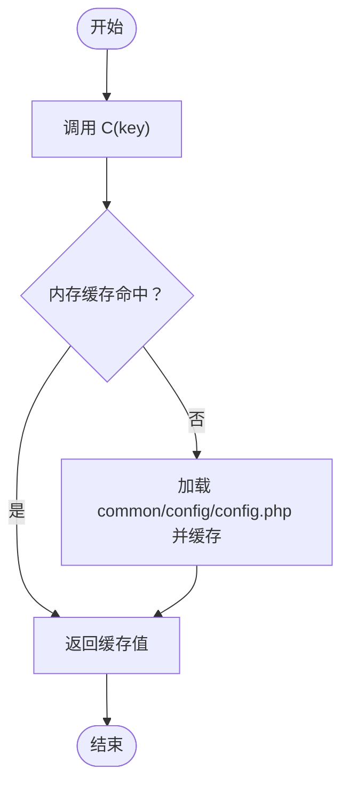
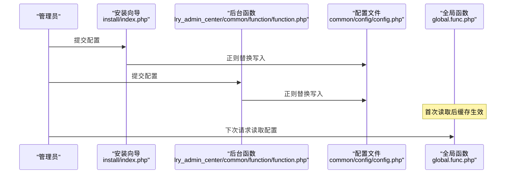
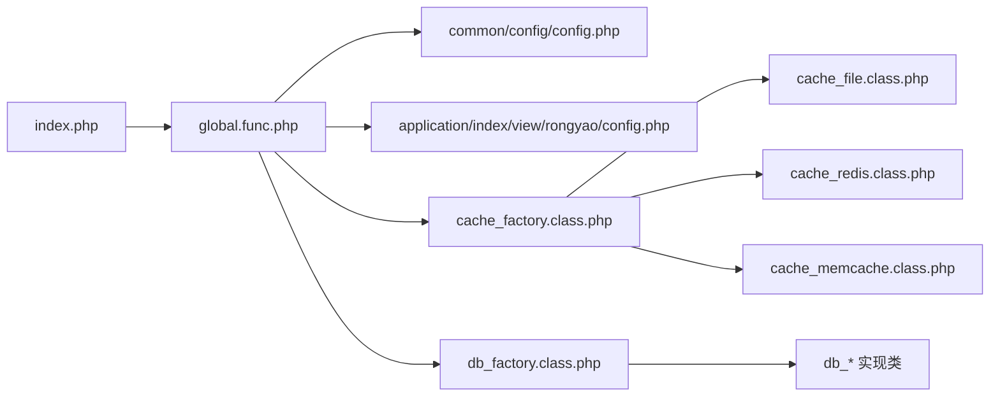

# 配置管理系统

<cite>
**本文引用的文件**
- [common/config/config.php](file://common/config/config.php)
- [application/index/view/rongyao/config.php](file://application/index/view/rongyao/config.php)
- [ryphp/core/function/global.func.php](file://ryphp/core/function/global.func.php)
- [application/install/index.php](file://application/install/index.php)
- [application/lry_admin_center/common/function/function.php](file://application/lry_admin_center/common/function/function.php)
- [ryphp/core/class/cache_factory.class.php](file://ryphp/core/class/cache_factory.class.php)
- [ryphp/core/class/db_factory.class.php](file://ryphp/core/class/db_factory.class.php)
- [ryphp/core/class/cache_file.class.php](file://ryphp/core/class/cache_file.class.php)
- [ryphp/core/class/cache_redis.class.php](file://ryphp/core/class/cache_redis.class.php)
- [ryphp/core/class/cache_memcache.class.php](file://ryphp/core/class/cache_memcache.class.php)
- [application/lry_admin_center/controller/clear_cache.class.php](file://application/lry_admin_center/controller/clear_cache.class.php)
- [backup_mysql_claude.sh](file://backup_mysql_claude.sh)
- [restore_mysql_claude.sh](file://restore_mysql_claude.sh)
- [index.php](file://index.php)
</cite>

## 目录
1. [简介](#简介)
2. [项目结构](#项目结构)
3. [核心组件](#核心组件)
4. [架构总览](#架构总览)
5. [详细组件分析](#详细组件分析)
6. [依赖关系分析](#依赖关系分析)
7. [性能考量](#性能考量)
8. [故障排除指南](#故障排除指南)
9. [结论](#结论)
10. [附录](#附录)

## 简介
本文件面向系统管理员与开发人员，全面梳理 LRYBlog 的配置管理体系，涵盖配置文件的结构与组织、配置项优先级与覆盖机制、热更新能力、配置验证与错误处理、备份与恢复策略、跨环境迁移指南以及最佳实践与故障排除建议。文档基于仓库实际源码进行分析，所有技术细节均以具体文件与行号为依据。

## 项目结构
LRYBlog 的配置体系围绕以下层次展开：
- 全局配置：集中于 common/config/config.php，包含系统、数据库、缓存、队列、语言、附件等核心配置。
- 主题模板配置：位于 application/index/view/{theme}/config.php，描述主题的模板映射与元信息。
- 运行期配置读取：通过全局函数与工厂类按需加载与实例化，实现配置的延迟加载与缓存。
- 配置写入与热更新：通过安装向导与后台函数对配置文件进行正则替换写入；缓存配置支持运行期切换与刷新。
- 备份与恢复：提供数据库备份与恢复脚本，保障配置变更的安全性与可回滚性。

图表来源
- [index.php](file://index.php#L10-L18)
- [ryphp/core/function/global.func.php](file://ryphp/core/function/global.func.php#L4-L26)
- [common/config/config.php](file://common/config/config.php#L1-L88)
- [application/index/view/rongyao/config.php](file://application/index/view/rongyao/config.php#L1-L29)
- [ryphp/core/class/cache_factory.class.php](file://ryphp/core/class/cache_factory.class.php#L36-L82)
- [ryphp/core/class/db_factory.class.php](file://ryphp/core/class/db_factory.class.php#L11-L49)
- [ryphp/core/class/cache_file.class.php](file://ryphp/core/class/cache_file.class.php#L1-L130)
- [ryphp/core/class/cache_redis.class.php](file://ryphp/core/class/cache_redis.class.php#L1-L108)
- [ryphp/core/class/cache_memcache.class.php](file://ryphp/core/class/cache_memcache.class.php#L1-L91)

章节来源
- [index.php](file://index.php#L10-L18)
- [ryphp/core/function/global.func.php](file://ryphp/core/function/global.func.php#L4-L26)

## 核心组件
- 配置读取函数
  - C()：读取 common/config/config.php 的全局配置，支持键名为空时返回全部配置，支持默认值回退。
  - config()：按文件名分发读取，支持“文件名.键名”的点语法访问，内部使用静态数组缓存已加载配置，避免重复 IO。
- 工厂类
  - cache_factory：根据 cache_type 选择缓存实现（file/redis/memcache），并延迟初始化缓存实例。
  - db_factory：根据 db_type 选择数据库实现（mysql/mysqli/pdo），并注入配置参数。
- 缓存实现
  - cache_file：文件型缓存，支持序列化与可执行数组两种持久化模式，具备过期判断与批量清理。
  - cache_redis：Redis 缓存，支持前缀、超时与持久连接。
  - cache_memcache：Memcache 缓存，支持前缀、超时与持久连接。
- 配置写入
  - 安装向导 set_config()：对 common/config/config.php 进行正则替换写入。
  - 后台 set_configFile()：对配置文件进行正则替换写入，带基础清洗与锁定写入。

章节来源
- [ryphp/core/function/global.func.php](file://ryphp/core/function/global.func.php#L4-L26)
- [ryphp/core/function/global.func.php](file://ryphp/core/function/global.func.php#L67-L79)
- [ryphp/core/class/cache_factory.class.php](file://ryphp/core/class/cache_factory.class.php#L36-L82)
- [ryphp/core/class/db_factory.class.php](file://ryphp/core/class/db_factory.class.php#L11-L49)
- [ryphp/core/class/cache_file.class.php](file://ryphp/core/class/cache_file.class.php#L1-L130)
- [ryphp/core/class/cache_redis.class.php](file://ryphp/core/class/cache_redis.class.php#L1-L108)
- [ryphp/core/class/cache_memcache.class.php](file://ryphp/core/class/cache_memcache.class.php#L1-L91)
- [application/install/index.php](file://application/install/index.php#L321-L335)
- [application/lry_admin_center/common/function/function.php](file://application/lry_admin_center/common/function/function.php#L90-L102)

## 架构总览
配置系统采用“集中式配置 + 工厂按需加载 + 缓存加速”的架构。全局配置由 C() 读取并缓存；按需模块通过工厂类读取配置并实例化具体实现。配置写入通过正则替换直接修改配置文件，实现“热更新”效果（需注意缓存一致性）。

图表来源
- [index.php](file://index.php#L10-L18)
- [ryphp/core/function/global.func.php](file://ryphp/core/function/global.func.php#L4-L26)
- [common/config/config.php](file://common/config/config.php#L39-L66)
- [ryphp/core/class/cache_factory.class.php](file://ryphp/core/class/cache_factory.class.php#L36-L82)
- [ryphp/core/class/cache_file.class.php](file://ryphp/core/class/cache_file.class.php#L1-L130)
- [ryphp/core/class/cache_redis.class.php](file://ryphp/core/class/cache_redis.class.php#L1-L108)

## 详细组件分析

### 配置文件结构与分类管理
- 全局配置（common/config/config.php）
  - 系统配置：站点主题、URL 后缀、PATHINFO 支持等。
  - 数据库配置：类型、主机、端口、字符集、表前缀等。
  - 路由配置：默认路由、映射开关与规则。
  - Cookie 配置：域、路径、生命周期、前缀、安全标志等。
  - 缓存配置：类型与三类实现的子配置（文件、Redis、Memcache）。
  - 队列配置：连接类型与队列名称。
  - 语言与附件：语言、上传类型、水印等。
  - 其他设置：SQL 执行、模板编辑、验证码等。
- 主题模板配置（application/index/view/{theme}/config.php）
  - 描述主题元信息与模板映射：分类页、列表页、内容页模板清单。

章节来源
- [common/config/config.php](file://common/config/config.php#L1-L88)
- [application/index/view/rongyao/config.php](file://application/index/view/rongyao/config.php#L1-L29)

### 配置项优先级与覆盖机制
- 读取优先级
  - C()：优先从内存缓存返回；若未命中，读取 common/config/config.php 并缓存。
  - config()：按“文件名.键名”分发读取，按需加载对应文件并缓存。
- 写入覆盖
  - 安装向导 set_config()：对 common/config/config.php 进行正则替换写入。
  - 后台 set_configFile()：对配置文件进行正则替换写入，带基础清洗与锁定写入。
- 运行期覆盖
  - 工厂类读取配置后构造实例，若需动态切换（如缓存类型），可重新初始化工厂实例以应用新配置。

图表来源
- [ryphp/core/function/global.func.php](file://ryphp/core/function/global.func.php#L4-L26)

章节来源
- [ryphp/core/function/global.func.php](file://ryphp/core/function/global.func.php#L4-L26)
- [application/install/index.php](file://application/install/index.php#L321-L335)
- [application/lry_admin_center/common/function/function.php](file://application/lry_admin_center/common/function/function.php#L90-L102)

### 配置热更新机制
- 文件写入热更新
  - 通过 set_config()/set_configFile() 对配置文件进行正则替换写入，无需重启 Web 服务即可生效。
  - 注意：C() 与 config() 使用静态缓存，首次读取后不会自动刷新，需要在写入后重建请求上下文或显式清缓存。
- 缓存一致性
  - 若修改了缓存类型或参数，应先刷新缓存实例，避免旧配置继续生效。
  - 提供清理模板缓存的控制器接口，便于在配置变更后清理视图缓存。

图表来源
- [application/install/index.php](file://application/install/index.php#L321-L335)
- [application/lry_admin_center/common/function/function.php](file://application/lry_admin_center/common/function/function.php#L90-L102)
- [ryphp/core/function/global.func.php](file://ryphp/core/function/global.func.php#L4-L26)

章节来源
- [application/install/index.php](file://application/install/index.php#L321-L335)
- [application/lry_admin_center/common/function/function.php](file://application/lry_admin_center/common/function/function.php#L90-L102)
- [ryphp/core/function/global.func.php](file://ryphp/core/function/global.func.php#L4-L26)

### 配置验证与错误处理
- 配置项校验
  - 缓存实现类在构造时会检查扩展是否加载（Redis/Memcache），未加载时输出错误消息。
  - 数据库工厂在构造时根据 db_type 选择实现类，若未识别则回退到默认实现。
- 默认值设置
  - C() 支持传入默认值，当配置不存在时返回默认值。
  - config() 支持传入默认值，当配置不存在时返回默认值。
- 异常处理
  - 缓存实现类在读取文件时区分序列化与可执行数组两种模式，避免解析失败导致异常。
  - 后台写入函数在写入前检查文件可写性，不可写时返回错误消息。

章节来源
- [ryphp/core/class/cache_redis.class.php](file://ryphp/core/class/cache_redis.class.php#L30-L51)
- [ryphp/core/class/cache_memcache.class.php](file://ryphp/core/class/cache_memcache.class.php#L27-L36)
- [ryphp/core/class/db_factory.class.php](file://ryphp/core/class/db_factory.class.php#L11-L32)
- [ryphp/core/function/global.func.php](file://ryphp/core/function/global.func.php#L4-L26)
- [ryphp/core/function/global.func.php](file://ryphp/core/function/global.func.php#L67-L79)
- [application/lry_admin_center/common/function/function.php](file://application/lry_admin_center/common/function/function.php#L90-L102)

### 配置备份与恢复策略
- 数据库备份与恢复
  - 提供增强版备份与恢复脚本，支持压缩、事务、存储过程与触发器等参数控制。
  - 自动检查 MySQL 服务状态、配置文件权限与连接可用性。
  - 支持批量清理与日志记录，保证备份与恢复过程可审计。
- 配置变更安全
  - 建议在修改配置前先备份配置文件与数据库。
  - 使用恢复脚本进行回滚，确保变更可逆。

章节来源
- [backup_mysql_claude.sh](file://backup_mysql_claude.sh#L1-L273)
- [backup_mysql_claude.sh](file://backup_mysql_claude.sh#L258-L337)
- [restore_mysql_claude.sh](file://restore_mysql_claude.sh#L208-L341)

### 配置迁移指南
- 环境迁移步骤
  - 备份源环境的配置文件与数据库。
  - 在目标环境部署后，使用安装向导或后台函数写入目标环境的配置项。
  - 验证缓存与数据库连接，必要时清理缓存。
- 注意事项
  - 不同环境的数据库凭据、缓存地址与端口需分别配置。
  - 主题模板路径与资源目录需保持一致或相应调整。

章节来源
- [application/install/index.php](file://application/install/index.php#L321-L335)
- [application/lry_admin_center/common/function/function.php](file://application/lry_admin_center/common/function/function.php#L90-L102)
- [common/config/config.php](file://common/config/config.php#L13-L87)

### 最佳实践与故障排除
- 最佳实践
  - 使用后台函数进行配置修改，避免手动编辑配置文件引发语法错误。
  - 修改缓存类型后，先刷新缓存实例，再清理模板缓存。
  - 定期备份配置与数据库，保留多个版本以便回滚。
- 故障排除
  - 缓存扩展未加载：检查 Redis/Memcache 扩展安装与配置。
  - 配置文件不可写：检查 common/config/config.php 权限。
  - 缓存读取异常：确认缓存目录可写与持久化模式设置正确。
  - 数据库连接失败：检查主机、端口、用户名与密码。

章节来源
- [ryphp/core/class/cache_redis.class.php](file://ryphp/core/class/cache_redis.class.php#L30-L51)
- [ryphp/core/class/cache_memcache.class.php](file://ryphp/core/class/cache_memcache.class.php#L27-L36)
- [application/lry_admin_center/common/function/function.php](file://application/lry_admin_center/common/function/function.php#L90-L102)
- [application/lry_admin_center/controller/clear_cache.class.php](file://application/lry_admin_center/controller/clear_cache.class.php#L9-L24)

## 依赖关系分析
- 配置读取链路
  - 入口 index.php -> 全局函数 C()/config() -> 配置文件 -> 工厂类 -> 具体实现。
- 缓存依赖
  - cache_factory 依赖 C('cache_type') 与对应子配置，按需加载缓存实现类。
- 数据库依赖
  - db_factory 依赖 C('db_type') 与数据库连接参数，按需加载数据库实现类。

图表来源
- [index.php](file://index.php#L10-L18)
- [ryphp/core/function/global.func.php](file://ryphp/core/function/global.func.php#L4-L26)
- [common/config/config.php](file://common/config/config.php#L1-L88)
- [application/index/view/rongyao/config.php](file://application/index/view/rongyao/config.php#L1-L29)
- [ryphp/core/class/cache_factory.class.php](file://ryphp/core/class/cache_factory.class.php#L36-L82)
- [ryphp/core/class/db_factory.class.php](file://ryphp/core/class/db_factory.class.php#L11-L49)
- [ryphp/core/class/cache_file.class.php](file://ryphp/core/class/cache_file.class.php#L1-L130)
- [ryphp/core/class/cache_redis.class.php](file://ryphp/core/class/cache_redis.class.php#L1-L108)
- [ryphp/core/class/cache_memcache.class.php](file://ryphp/core/class/cache_memcache.class.php#L1-L91)

## 性能考量
- 配置读取缓存
  - C() 与 config() 使用静态数组缓存，避免重复 IO，提升性能。
- 缓存实现选择
  - 文件缓存适合小规模场景；Redis/Memcache 适合高并发与分布式场景。
- 模板缓存清理
  - 提供清理模板缓存的控制器接口，减少磁盘占用与提高响应速度。

章节来源
- [ryphp/core/function/global.func.php](file://ryphp/core/function/global.func.php#L4-L26)
- [ryphp/core/class/cache_file.class.php](file://ryphp/core/class/cache_file.class.php#L1-L130)
- [application/lry_admin_center/controller/clear_cache.class.php](file://application/lry_admin_center/controller/clear_cache.class.php#L9-L24)

## 故障排除指南
- 配置写入失败
  - 检查 common/config/config.php 权限是否可写。
  - 使用后台函数进行写入，避免手动编辑导致的语法错误。
- 缓存异常
  - 检查 Redis/Memcache 扩展是否安装并启用。
  - 确认缓存目录可写，持久化模式与过期时间设置合理。
- 数据库连接问题
  - 核对主机、端口、用户名与密码。
  - 检查防火墙与网络连通性。
- 视图缓存未更新
  - 使用清理缓存接口清除模板缓存。

章节来源
- [application/lry_admin_center/common/function/function.php](file://application/lry_admin_center/common/function/function.php#L90-L102)
- [ryphp/core/class/cache_redis.class.php](file://ryphp/core/class/cache_redis.class.php#L30-L51)
- [ryphp/core/class/cache_memcache.class.php](file://ryphp/core/class/cache_memcache.class.php#L27-L36)
- [application/lry_admin_center/controller/clear_cache.class.php](file://application/lry_admin_center/controller/clear_cache.class.php#L9-L24)

## 结论
LRYBlog 的配置管理系统以集中式配置为核心，结合工厂模式与缓存机制，实现了灵活、可扩展且易于维护的配置管理能力。通过安装向导与后台函数提供的热更新能力，可在不重启服务的情况下完成配置变更；配合完善的备份与恢复脚本，确保变更的安全性与可回滚性。建议在生产环境中遵循本文的最佳实践，定期备份、谨慎变更，并在变更后及时清理缓存以确保一致性。

## 附录
- 关键配置项速览
  - 系统：站点主题、URL 后缀、PATHINFO 支持。
  - 数据库：类型、主机、端口、字符集、表前缀。
  - 缓存：类型与三类实现的子配置。
  - 队列：连接类型与队列名称。
  - 语言与附件：语言、上传类型、水印。
  - 其他：SQL 执行、模板编辑、验证码。
- 相关文件路径
  - 全局配置：common/config/config.php
  - 主题模板配置：application/index/view/rongyao/config.php
  - 配置读取：ryphp/core/function/global.func.php
  - 配置写入：application/install/index.php、application/lry_admin_center/common/function/function.php
  - 缓存工厂：ryphp/core/class/cache_factory.class.php
  - 数据库工厂：ryphp/core/class/db_factory.class.php
  - 缓存实现：ryphp/core/class/cache_file.class.php、ryphp/core/class/cache_redis.class.php、ryphp/core/class/cache_memcache.class.php
  - 缓存清理：application/lry_admin_center/controller/clear_cache.class.php
  - 备份与恢复：backup_mysql_claude.sh、restore_mysql_claude.sh