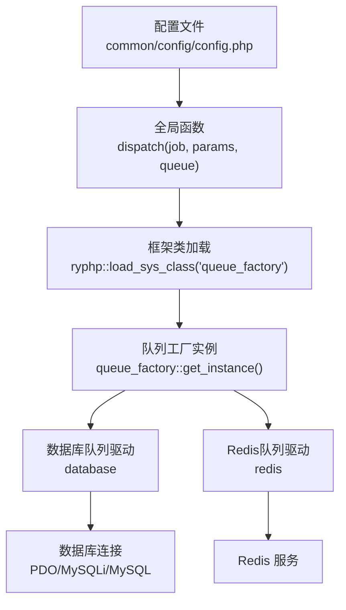
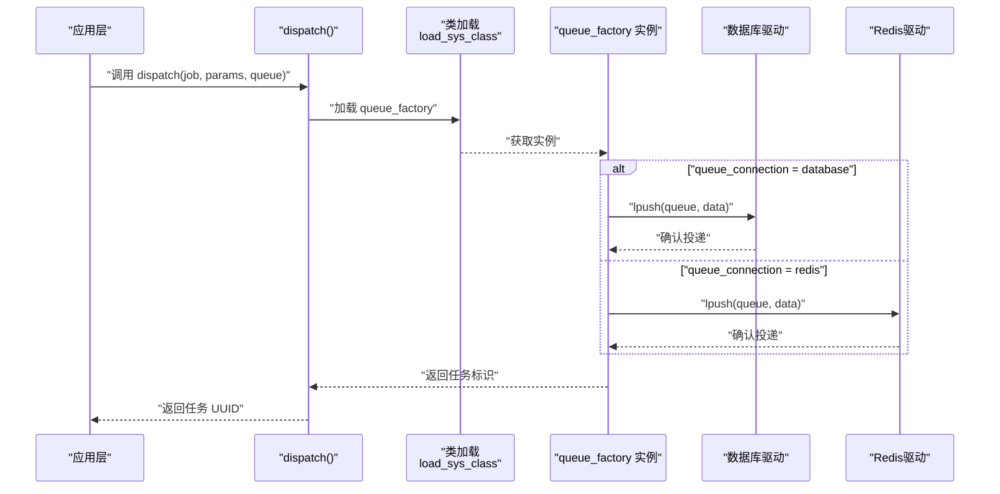
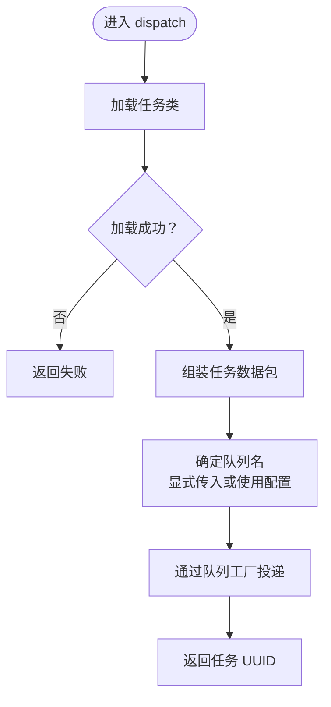
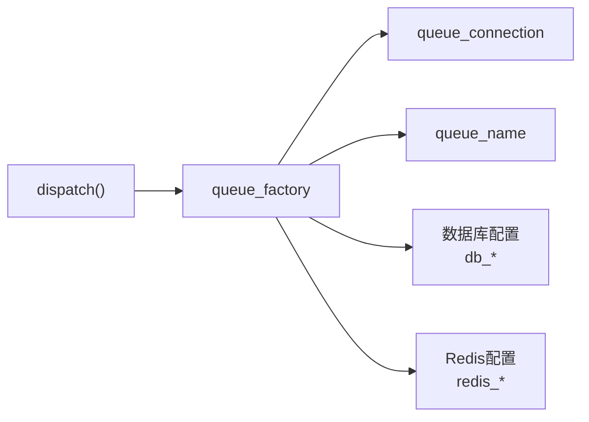

# 队列配置

<cite>
**本文引用的文件**
- [common/config/config.php](file://common/config/config.php)
- [ryphp/core/function/global.func.php](file://ryphp/core/function/global.func.php)
- [ryphp/ryphp.php](file://ryphp/ryphp.php)
- [ryphp/core/class/db_factory.class.php](file://ryphp/core/class/db_factory.class.php)
- [ryphp/core/class/db_pdo_optimized.class.php](file://ryphp/core/class/db_pdo_optimized.class.php)
</cite>

## 目录
1. [简介](#简介)
2. [项目结构](#项目结构)
3. [核心组件](#核心组件)
4. [架构总览](#架构总览)
5. [详细组件分析](#详细组件分析)
6. [依赖分析](#依赖分析)
7. [性能考虑](#性能考虑)
8. [故障排除指南](#故障排除指南)
9. [结论](#结论)
10. [附录](#附录)

## 简介
本章节面向 LRYBlog 的队列配置，聚焦以下关键点：
- 队列连接配置 queue_connection 与队列名称 queue_name 的含义与设置方法
- 支持的队列驱动类型：数据库队列(database)与 Redis 队列(redis)，以及它们的特性与适用场景
- 队列在异步任务处理中的作用与调用流程
- 驱动选择的决策依据与性能对比
- 队列配置的监控方法、故障排除与性能优化建议
- 队列配置与系统其他组件（如数据库、缓存、框架加载机制）的集成关系

## 项目结构
LRYBlog 的队列配置位于系统配置集中，通过统一的配置数组进行管理；异步任务下发通过框架提供的全局函数完成，并由框架加载队列工厂类进行实际投递。

图表来源
- [common/config/config.php](file://common/config/config.php#L68-L70)
- [ryphp/core/function/global.func.php](file://ryphp/core/function/global.func.php#L1565-L1580)
- [ryphp/ryphp.php](file://ryphp/ryphp.php#L108-L140)

章节来源
- [common/config/config.php](file://common/config/config.php#L68-L70)
- [ryphp/core/function/global.func.php](file://ryphp/core/function/global.func.php#L1565-L1580)
- [ryphp/ryphp.php](file://ryphp/ryphp.php#L108-L140)

## 核心组件
- 队列配置项
  - queue_connection：队列驱动类型，支持 database 与 redis
  - queue_name：队列名称，默认 default
- 全局任务下发函数 dispatch(job, params, queue)
  - 将任务序列化并投递到指定队列
  - 若未显式传入 queue，则使用配置中的 queue_name
- 框架类加载机制
  - 通过 ryphp::load_sys_class 加载队列工厂类 queue_factory
  - 由该工厂根据配置选择具体驱动并执行 lpush 投递

章节来源
- [common/config/config.php](file://common/config/config.php#L68-L70)
- [ryphp/core/function/global.func.php](file://ryphp/core/function/global.func.php#L1565-L1580)
- [ryphp/ryphp.php](file://ryphp/ryphp.php#L108-L140)

## 架构总览
队列在 LRYBlog 中承担异步任务投递职责。调用链如下：
- 应用层调用 dispatch(...) 下发任务
- 框架加载队列工厂类
- 工厂根据 queue_connection 选择驱动
- 驱动将任务持久化到数据库或 Redis
- 后台消费者进程从对应介质拉取并执行任务

图表来源
- [ryphp/core/function/global.func.php](file://ryphp/core/function/global.func.php#L1565-L1580)
- [common/config/config.php](file://common/config/config.php#L68-L70)

## 详细组件分析

### 配置项详解：queue_connection 与 queue_name
- queue_connection
  - 取值：database 或 redis
  - 影响：决定任务投递介质与后续消费方式
- queue_name
  - 取值：字符串，代表队列逻辑分组名
  - 影响：当调用 dispatch 未显式传入队列名时，使用此默认值

章节来源
- [common/config/config.php](file://common/config/config.php#L68-L70)

### 任务下发流程：dispatch 函数
- 功能要点
  - 校验并加载任务类
  - 组装任务数据包（含唯一标识、任务类名、序列化对象、尝试次数、创建时间）
  - 通过队列工厂投递至指定队列
- 关键行为
  - 若调用方未传入 queue 参数，则使用配置中的 queue_name
  - 返回任务 UUID，便于后续跟踪

图表来源
- [ryphp/core/function/global.func.php](file://ryphp/core/function/global.func.php#L1565-L1580)
- [common/config/config.php](file://common/config/config.php#L68-L70)

章节来源
- [ryphp/core/function/global.func.php](file://ryphp/core/function/global.func.php#L1565-L1580)

### 队列驱动选择与适用场景
- 数据库队列(database)
  - 特点
    - 无需额外中间件，直接使用现有数据库
    - 适合低并发、开发/测试环境或对可靠性要求高但吞吐要求不高的场景
  - 注意事项
    - 需要数据库具备队列表结构（由框架或迁移脚本提供）
    - 高并发写入可能带来数据库压力
- Redis 队列(redis)
  - 特点
    - 基于内存的高性能消息队列，延迟低、吞吐高
    - 适合生产环境高并发异步任务
  - 注意事项
    - 需要独立的 Redis 服务与网络连通性
    - 需关注持久化策略与内存占用

章节来源
- [common/config/config.php](file://common/config/config.php#L68-L70)

### 队列与数据库/缓存的集成关系
- 数据库
  - 队列驱动为 database 时，任务持久化至数据库
  - 数据库连接由框架统一管理，遵循系统数据库配置
- 缓存
  - 缓存配置与队列配置并行存在，互不影响
  - 若使用 Redis 驱动，建议复用已有的 Redis 缓存配置，避免重复连接

章节来源
- [common/config/config.php](file://common/config/config.php#L13-L21)
- [common/config/config.php](file://common/config/config.php#L48-L57)
- [ryphp/core/class/db_factory.class.php](file://ryphp/core/class/db_factory.class.php#L11-L50)
- [ryphp/core/class/db_pdo_optimized.class.php](file://ryphp/core/class/db_pdo_optimized.class.php#L87-L97)

## 依赖分析
- dispatch 对队列工厂的依赖
  - 通过框架类加载机制动态定位并实例化队列工厂
- 队列工厂对配置的依赖
  - 读取 queue_connection 与 queue_name 决定驱动与队列名
- 数据库驱动对配置的依赖
  - 当使用 database 驱动时，数据库连接参数来自系统配置

图表来源
- [ryphp/core/function/global.func.php](file://ryphp/core/function/global.func.php#L1565-L1580)
- [common/config/config.php](file://common/config/config.php#L68-L70)
- [common/config/config.php](file://common/config/config.php#L13-L21)
- [common/config/config.php](file://common/config/config.php#L48-L57)

章节来源
- [ryphp/core/function/global.func.php](file://ryphp/core/function/global.func.php#L1565-L1580)
- [common/config/config.php](file://common/config/config.php#L68-L70)
- [ryphp/core/class/db_factory.class.php](file://ryphp/core/class/db_factory.class.php#L11-L50)

## 性能考虑
- 驱动选择
  - 生产高并发：优先 Redis 队列
  - 开发/低并发：可使用数据库队列
- Redis 队列优化
  - 使用长连接减少连接开销
  - 合理设置超时与过期时间
  - 将队列与业务数据分离，避免共享实例资源争用
- 数据库队列优化
  - 为队列表建立合适的索引
  - 控制单次批量投递规模，避免阻塞
  - 在业务低峰期执行队列表维护操作

## 故障排除指南
- 无法加载队列工厂
  - 检查类文件是否存在与命名空间/路径是否正确
  - 确认框架类加载路径与常量定义
- Redis 队列异常
  - 检查 Redis 服务连通性与认证配置
  - 观察内存使用与持久化策略
- 数据库队列异常
  - 检查队列表是否存在且结构正确
  - 查看数据库连接参数与权限
- 任务未被消费
  - 确认消费者进程正常运行
  - 核对 queue_name 与消费者监听的队列一致
- 任务重复或丢失
  - 校验任务幂等设计
  - 检查驱动实现与事务一致性

章节来源
- [ryphp/ryphp.php](file://ryphp/ryphp.php#L118-L140)
- [common/config/config.php](file://common/config/config.php#L48-L57)
- [common/config/config.php](file://common/config/config.php#L13-L21)

## 结论
LRYBlog 的队列配置采用集中式配置与框架化加载相结合的方式，通过 queue_connection 与 queue_name 两个关键配置项即可快速切换与定制队列驱动。对于大多数生产场景，推荐使用 Redis 队列以获得更好的吞吐与延迟表现；在开发或低负载环境下，数据库队列提供了零依赖的便捷方案。结合合理的监控与优化策略，可稳定支撑异步任务处理需求。

## 附录
- 配置项速查
  - queue_connection：database 或 redis
  - queue_name：默认 default
- 相关配置参考
  - 数据库连接参数：db_host、db_name、db_user、db_pwd、db_port、db_charset、db_prefix
  - Redis 连接参数：host、port、password、select、timeout、expire、persistent、prefix

章节来源
- [common/config/config.php](file://common/config/config.php#L13-L21)
- [common/config/config.php](file://common/config/config.php#L48-L57)
- [common/config/config.php](file://common/config/config.php#L68-L70)