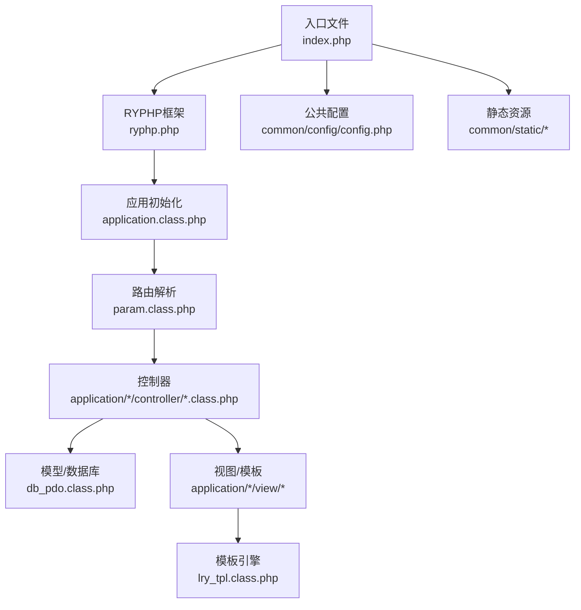
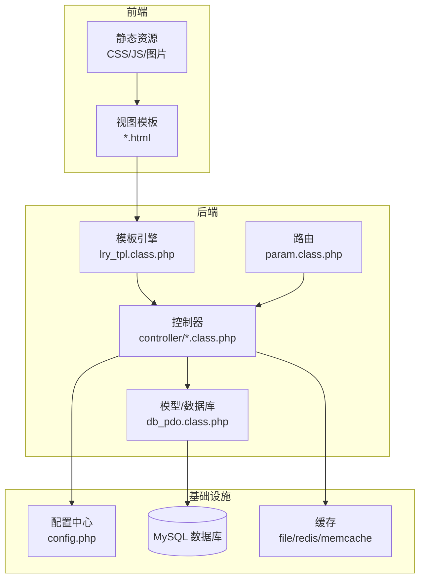
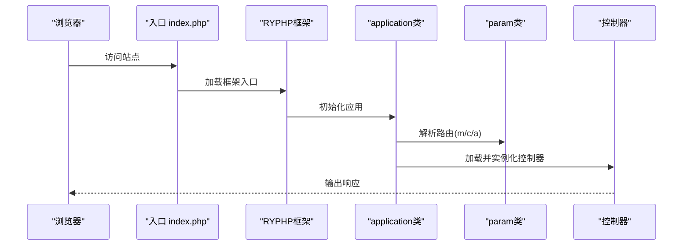
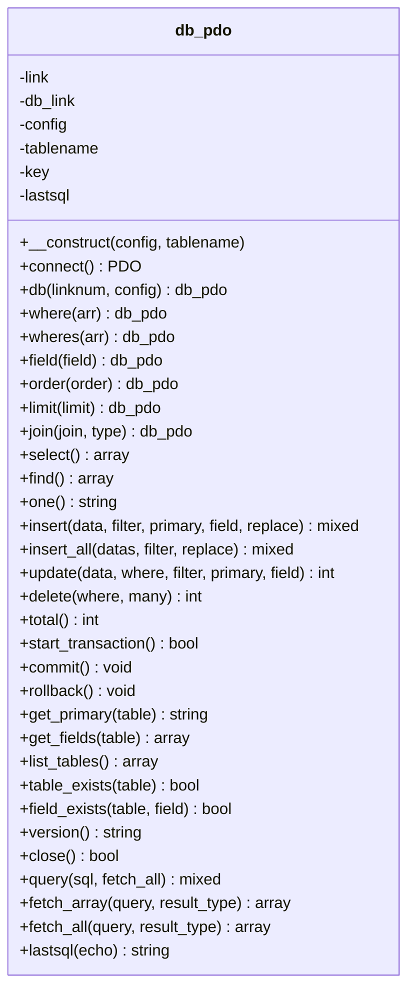
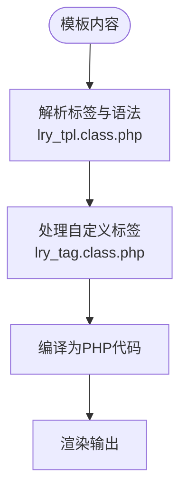
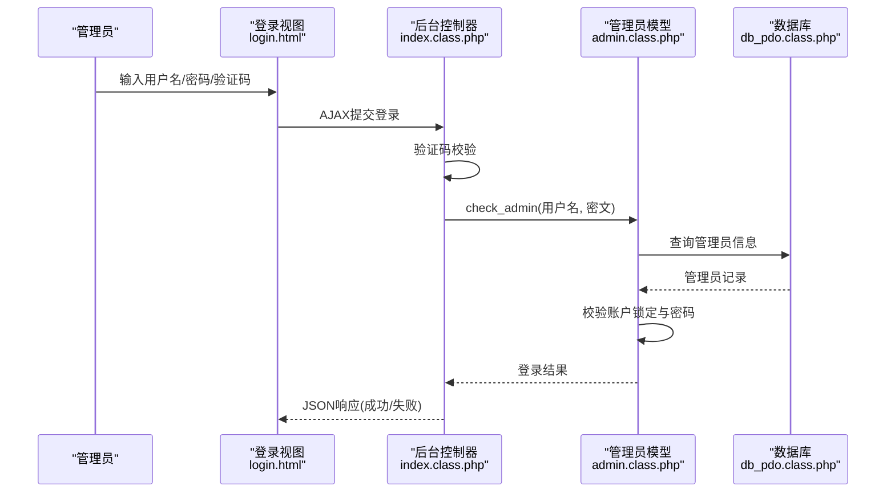
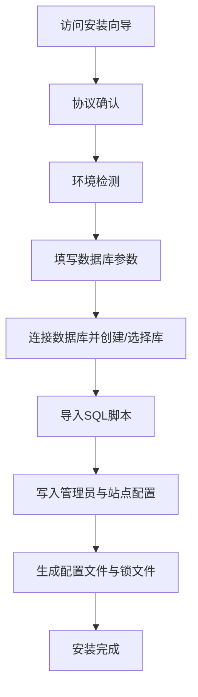
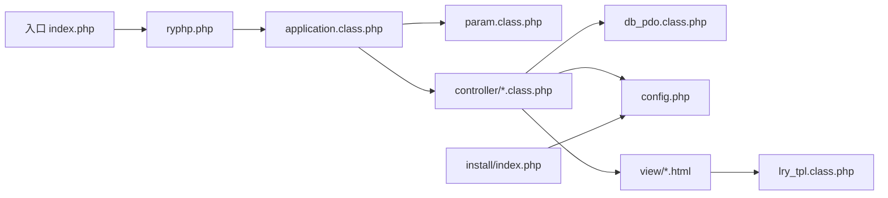

# 项目概述

<cite>
**本文档引用的文件**
- [README.md](file://README.md)
- [index.php](file://index.php)
- [ryphp.php](file://ryphp/ryphp.php)
- [application.class.php](file://ryphp/core/class/application.class.php)
- [param.class.php](file://ryphp/core/class/param.class.php)
- [db_pdo.class.php](file://ryphp/core/class/db_pdo.class.php)
- [lry_tpl.class.php](file://ryphp/core/class/lry_tpl.class.php)
- [config.php](file://common/config/config.php)
- [index.class.php (前台)](file://application/index/controller/index.class.php)
- [index.class.php (后台)](file://application/lry_admin_center/controller/index.class.php)
- [login.html](file://application/lry_admin_center/view/login.html)
- [public_home.html](file://application/lry_admin_center/view/public_home.html)
- [admin.class.php](file://application/lry_admin_center/model/admin.class.php)
- [index.php (安装程序)](file://application/install/index.php)
- [s1.php (安装协议)](file://application/install/templates/s1.php)
- [show_article.html](file://application/index/view/rongyao/show_article.html)
- [lry_tag.class.php](file://ryphp/core/class/lry_tag.class.php)
- [system.func.php](file://common/function/system.func.php)
</cite>

## 目录
1. [引言](#引言)
2. [项目结构](#项目结构)
3. [核心组件](#核心组件)
4. [架构总览](#架构总览)
5. [详细组件分析](#详细组件分析)
6. [依赖关系分析](#依赖关系分析)
7. [性能考量](#性能考量)
8. [故障排查指南](#故障排查指南)
9. [结论](#结论)
10. [附录](#附录)

## 引言
LRYBlog 是一个基于自研 RYPHP 框架开发的轻量级博客内容管理系统（CMS）。它提供完整的博客发布、管理与展示能力，采用 MVC 架构与模块化设计，支持前后端分离结构。系统内置模板引擎、数据库抽象层、路由与缓存机制，辅以安装向导、后台管理界面与丰富的前端静态资源，适合快速搭建个人博客或小型企业内容平台。

项目强调易用性与可扩展性，既为初学者提供清晰的认知框架，也为有经验的开发者提供技术决策背景与实现细节支撑。

## 项目结构
项目采用典型的 MVC 分层与模块化组织方式：
- 入口与框架
  - 入口文件负责全局常量定义与框架引导
  - RYPHP 框架提供应用初始化、类加载、路由与模板解析等核心能力
- 应用模块
  - 前台模块：提供博客展示、文章阅读、分类浏览等功能
  - 后台管理中心：提供登录、权限控制、内容管理、系统配置等
  - API 模块：提供验证码、接口等通用能力
  - 安装模块：提供一键安装流程与数据库初始化
- 公共资源与配置
  - 配置文件集中管理数据库、缓存、路由、上传等系统参数
  - 静态资源（CSS/JS/图片）按模块与主题组织
  - 模板视图按模块与主题划分，支持主题切换

**图表来源**
- [index.php](file://index.php#L1-L18)
- [ryphp.php](file://ryphp/ryphp.php#L83-L202)
- [application.class.php](file://ryphp/core/class/application.class.php#L4-L40)
- [param.class.php](file://ryphp/core/class/param.class.php#L3-L15)
- [db_pdo.class.php](file://ryphp/core/class/db_pdo.class.php#L10-L646)
- [lry_tpl.class.php](file://ryphp/core/class/lry_tpl.class.php#L10-L134)
- [config.php](file://common/config/config.php#L1-L88)

**章节来源**
- [index.php](file://index.php#L1-L18)
- [ryphp.php](file://ryphp/ryphp.php#L83-L202)
- [config.php](file://common/config/config.php#L1-L88)

## 核心组件
- 入口与框架引导
  - 入口文件定义调试开关、根路径与 URL 模式，加载 RYPHP 框架并启动应用
  - 框架提供类加载、函数库加载、静态资源路径、时区与安全常量定义
- 应用初始化与路由
  - 应用类负责错误处理注册、路由参数解析与控制器加载
  - 参数类支持 PATHINFO 路由、URL 映射与安全过滤
- 数据库与模型
  - PDO 抽象层提供连接、预处理、事务、字段与表元数据查询等能力
  - 提供链式查询构造器（where、field、order、limit、join 等）
- 模板引擎与视图
  - 模板解析类支持标签语法、循环、条件与自定义标签回调
  - 视图按模块与主题组织，支持主题切换与静态资源引用
- 后台管理与安全
  - 登录流程包含验证码校验、密码验证、登录日志与账户锁定策略
  - 提供后台首页统计、权限控制与系统信息展示
- 安装与部署
  - 安装向导检测环境、创建数据库、导入数据、写入配置并生成锁文件

**章节来源**
- [index.php](file://index.php#L10-L18)
- [ryphp.php](file://ryphp/ryphp.php#L83-L202)
- [application.class.php](file://ryphp/core/class/application.class.php#L9-L40)
- [param.class.php](file://ryphp/core/class/param.class.php#L54-L99)
- [db_pdo.class.php](file://ryphp/core/class/db_pdo.class.php#L10-L646)
- [lry_tpl.class.php](file://ryphp/core/class/lry_tpl.class.php#L31-L92)
- [index.class.php (后台)](file://application/lry_admin_center/controller/index.class.php#L6-L38)
- [admin.class.php](file://application/lry_admin_center/model/admin.class.php#L4-L27)
- [index.php (安装程序)](file://application/install/index.php#L21-L373)

## 架构总览
系统采用经典的 MVC 模式与模块化设计，前后端分离体现在：
- 前端：HTML/CSS/JS 与模板引擎配合，负责用户交互与页面渲染
- 后端：控制器处理请求、模型访问数据库、视图输出模板
- 中间层：路由解析、模板解析、数据库抽象与缓存机制

**图表来源**
- [application.class.php](file://ryphp/core/class/application.class.php#L24-L40)
- [param.class.php](file://ryphp/core/class/param.class.php#L95-L134)
- [lry_tpl.class.php](file://ryphp/core/class/lry_tpl.class.php#L31-L92)
- [db_pdo.class.php](file://ryphp/core/class/db_pdo.class.php#L10-L646)
- [config.php](file://common/config/config.php#L13-L87)

## 详细组件分析

### 入口与应用初始化
- 入口文件定义调试与根路径常量，加载框架入口并设置 URL 模式
- 框架初始化应用类，注册错误处理与异常捕获，解析路由参数并加载对应控制器
- 控制器方法存在性校验与私有方法保护，确保安全访问

**图表来源**
- [index.php](file://index.php#L10-L18)
- [ryphp.php](file://ryphp/ryphp.php#L83-L202)
- [application.class.php](file://ryphp/core/class/application.class.php#L9-L40)
- [param.class.php](file://ryphp/core/class/param.class.php#L22-L46)

**章节来源**
- [index.php](file://index.php#L10-L18)
- [application.class.php](file://ryphp/core/class/application.class.php#L9-L40)
- [param.class.php](file://ryphp/core/class/param.class.php#L22-L46)

### 数据库与模型层（PDO 抽象）
- 连接管理：支持 PDO 预处理、错误处理与重连机制
- 查询构造：链式 API 支持 where、field、order、limit、join、group、having
- 事务支持：提供 start_transaction、commit、rollback
- 元数据：获取主键、表字段、表列表与存在性检查
- 安全：参数绑定、实体转义与 SQL 注入防护

**图表来源**
- [db_pdo.class.php](file://ryphp/core/class/db_pdo.class.php#L10-L646)

**章节来源**
- [db_pdo.class.php](file://ryphp/core/class/db_pdo.class.php#L10-L646)

### 模板引擎与视图
- 模板解析：支持标签替换、循环、条件、函数调用与自定义标签回调
- 标签系统：内置内容标签（如搜索、归档）与分页支持
- 视图组织：按模块与主题划分，支持主题切换与静态资源引用

**图表来源**
- [lry_tpl.class.php](file://ryphp/core/class/lry_tpl.class.php#L31-L92)
- [lry_tag.class.php](file://ryphp/core/class/lry_tag.class.php#L344-L368)

**章节来源**
- [lry_tpl.class.php](file://ryphp/core/class/lry_tpl.class.php#L31-L92)
- [lry_tag.class.php](file://ryphp/core/class/lry_tag.class.php#L344-L368)

### 后台登录与安全控制
- 登录流程：验证码校验、用户名/密码格式校验、管理员数据查询、密码比对
- 安全策略：账户锁定阈值与限时策略、登录日志记录、会话清理与 Cookie 清理
- 权限与界面：后台首页统计、个人信息展示与菜单导航

**图表来源**
- [login.html](file://application/lry_admin_center/view/login.html#L14-L95)
- [index.class.php (后台)](file://application/lry_admin_center/controller/index.class.php#L19-L38)
- [admin.class.php](file://application/lry_admin_center/model/admin.class.php#L4-L27)
- [db_pdo.class.php](file://ryphp/core/class/db_pdo.class.php#L365-L396)

**章节来源**
- [login.html](file://application/lry_admin_center/view/login.html#L14-L95)
- [index.class.php (后台)](file://application/lry_admin_center/controller/index.class.php#L19-L38)
- [admin.class.php](file://application/lry_admin_center/model/admin.class.php#L4-L27)

### 安装与部署
- 环境检测：PHP 版本、PDO/MYSQLI 扩展、GD、CURL、会话、上传大小等
- 数据库初始化：创建数据库、导入 SQL、写入管理员与站点配置
- 配置生成：动态更新配置文件、生成 auth_key、创建安装锁文件

**图表来源**
- [index.php (安装程序)](file://application/install/index.php#L45-L275)
- [s1.php (安装协议)](file://application/install/templates/s1.php#L22-L33)

**章节来源**
- [index.php (安装程序)](file://application/install/index.php#L21-L373)
- [s1.php (安装协议)](file://application/install/templates/s1.php#L22-L33)

### 前台展示与内容标签
- 文章展示：支持文章详情、上下篇导航、相关推荐、评论列表
- 内容标签：搜索、归档、分页等标签支持，配合模板引擎渲染
- 栏目管理：支持模型与发布权限控制、树形结构与禁用规则

**章节来源**
- [show_article.html](file://application/index/view/rongyao/show_article.html#L168-L208)
- [lry_tag.class.php](file://ryphp/core/class/lry_tag.class.php#L344-L368)
- [system.func.php](file://common/function/system.func.php#L347-L369)

## 依赖关系分析
- 入口依赖框架；框架依赖应用类与参数类；应用类依赖控制器与模板引擎
- 控制器依赖模型与配置；模型依赖数据库抽象层；视图依赖模板引擎
- 安装模块独立于主系统，完成后写入配置并生成锁文件

**图表来源**
- [index.php](file://index.php#L10-L18)
- [ryphp.php](file://ryphp/ryphp.php#L83-L202)
- [application.class.php](file://ryphp/core/class/application.class.php#L24-L40)
- [param.class.php](file://ryphp/core/class/param.class.php#L95-L134)
- [db_pdo.class.php](file://ryphp/core/class/db_pdo.class.php#L10-L646)
- [lry_tpl.class.php](file://ryphp/core/class/lry_tpl.class.php#L31-L92)
- [config.php](file://common/config/config.php#L1-L88)
- [index.php (安装程序)](file://application/install/index.php#L21-L373)

**章节来源**
- [index.php](file://index.php#L10-L18)
- [ryphp.php](file://ryphp/ryphp.php#L83-L202)
- [application.class.php](file://ryphp/core/class/application.class.php#L24-L40)

## 性能考量
- 调试与日志：调试模式下记录 SQL 与消息，非调试模式隐藏细节并可保存错误日志
- 缓存策略：支持文件、Redis、Memcache 三种缓存类型，可按需配置缓存目录与前缀
- 数据库优化：PDO 预处理与参数绑定减少 SQL 注入风险，事务支持保证一致性
- 模板渲染：模板编译为 PHP，减少运行时解析成本；标签缓存可降低重复计算
- 资源管理：静态资源按模块与主题组织，便于 CDN 与压缩优化

**章节来源**
- [config.php](file://common/config/config.php#L39-L87)
- [db_pdo.class.php](file://ryphp/core/class/db_pdo.class.php#L100-L124)
- [lry_tpl.class.php](file://ryphp/core/class/lry_tpl.class.php#L78-L91)

## 故障排查指南
- 访问异常与错误页面
  - 应用类提供统一错误提示与致命错误处理，非调试模式下返回标准 HTTP 状态码
- 数据库连接问题
  - PDO 连接异常时触发 halt，支持重连与错误日志记录
- 路由与控制器
  - 路由参数长度限制与非法字符过滤，控制器不存在或方法不可访问时抛出错误
- 安装问题
  - 安装锁文件存在时阻止重复安装；数据库连接失败与 SQL 执行失败均有明确提示

**章节来源**
- [application.class.php](file://ryphp/core/class/application.class.php#L108-L115)
- [db_pdo.class.php](file://ryphp/core/class/db_pdo.class.php#L37-L42)
- [param.class.php](file://ryphp/core/class/param.class.php#L54-L60)
- [index.php (安装程序)](file://application/install/index.php#L15-L17)

## 结论
LRYBlog 以 RYPHP 框架为基础，构建了模块化、可扩展的博客内容管理系统。其核心优势在于：
- 清晰的 MVC 架构与模块化组织，便于维护与二次开发
- 完整的安装向导与数据库抽象，降低部署门槛
- 丰富的模板标签与视图组织，满足多样化展示需求
- 安全的登录流程与错误处理机制，保障系统稳定运行

对于初学者，建议从入口文件与安装流程入手，逐步理解 MVC 与模板引擎；对于有经验的开发者，可深入数据库抽象层与缓存配置，结合实际场景进行性能优化与扩展。

## 附录
- 技术栈与优势
  - PHP：成熟稳定的后端语言生态
  - MySQL/PDO：高性能、跨平台的关系型数据库
  - jQuery：简化前端交互与 AJAX 请求
  - 模板引擎：提升视图渲染效率与可维护性
- 发展历程与应用场景
  - 项目提供安装协议与免责声明，适用于个人博客、小型企业官网与内容管理场景
- 适用人群
  - 初学者：通过安装向导与简单配置快速上线
  - 开发者：基于 MVC 与模块化设计进行功能扩展与性能优化

**章节来源**
- [README.md](file://README.md#L1-L6)
- [s1.php (安装协议)](file://application/install/templates/s1.php#L22-L33)